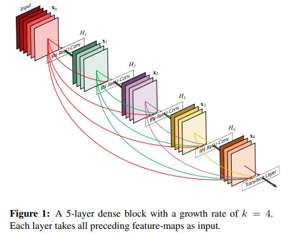
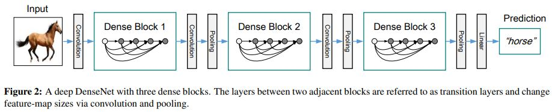
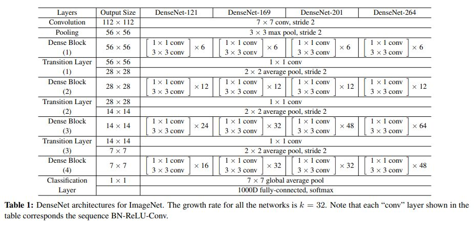
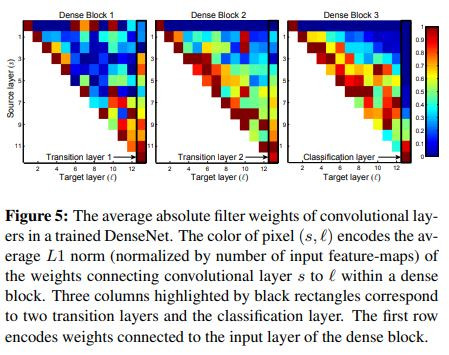

# Densely Connected Convolutional Networks

> **Abstract**
> 
- 최근 Convolution Network는 `Shortcut Connections` 사용하여 정확도와 학습에 효율적이다.
- 저자들은 해당 관점을 보강하여 **Dense Convolutional Network (DenseNet)** 만들었다. 해당 Network는 각 Layer 다른 Layer와 `Feed-forward` 연결한다
- DenseNet은 $L(L+1) / 2$ 직접적인 연결을 갖는다.
- 각각의 Layer는 모든 진행된 Layer의 Feature-Map 하위 Layer의 Input에 사용된다.

<aside>
📌 [DenseNet Adventage]
- vanishing-gradient 문제가 감소한다.
- feature propagation에 강하다.
- 점진적으로 Parameter가 감소된다.

</aside>

> **Introduction**
> 

- CNN의 깊이가 증가하면서, 새로운 연구 문제가 등장했다 : 정보(Input/Gradient)가 사라진다.
- `ResNet` 및 `FractalNet`에서 같은 접근 방식과 학습 절차는 모두 `Key Characteristic` 공유하는 것이다 : Network 들은 각각의 Layer에서 다른 Layer 갈 때, `Short Path` 생성한다.
- 이러한 구조를 고려하여 간단한 연결 패턴을 제안한다 : Feature-map 사이즈를 맞추어 모든 Layer 직접적으로 연결한다.
- 즉, 각 Layer는 모든 통과된 Layer의 추가적인 input 얻을 수 있고, 자기가 갖고 있는 Feature-map 하위 Layer에 전달할 수 있다.
- 중요한 점은 `ResNet` 과 달리 Layer 통과할 때, 더하기 연산으로 진행되는 것이 아니라 `Concatenating` 방식으로 Feature 결합한다는 것이다.
- $L(L+1) / 2$ 수식으로 L-Layer에 대해 연결 되어있으며 고전적인 L연결 구조와는 다르다. 이런 `Dense Connectivity Pattern` 인해 Dese Convolutional Network (DenseNet) 언급한다.
- `Dense Connectivity Pattern`의 직관적인 효과는 Parameter 수가 적으며, 불필요한 Feature-map에 대한 학습을 하지 않는 다는 것이다.

<aside>
📌 ResNet의 경우 Layer가 자신의 weight 갖고 있기 때문에 학습 Parameter가 상당히 크다.

</aside>

- DesNet의 경우 Layer가 협소하고, Feature-map이 변화하지 않은 상태로 연결되기 때문에 최종 Classifier는 모든 Feature-map 토대로 결정을 내릴 수 있다.
- DenseNet은 Parameter의 이점이 있기 때문에, 생성된 정보를 토대로 가장 큰 이점은 학습을 쉽게 한다.
- 각 Layer는 직접적으로 Loss Function의 Gradient에 접근 할 수 있기 때문에 Original Input에 대한 관리가 이루어 질 수 있다. 또한 Small Training Set에 대해 Overffiting 문제를 줄일 수 있다.

> **DenseNets**
> 

- single image `x0`가 Convolution Network에 들어간다 생각해보자. Network는 `L layer` 구성되어 있고 각각은 Non-Linear Transformation 실행된다.
- $H_l(ο)$ 수식에 대해서 `l`은 layer의 index 지칭한다. 그럴 때 H 수식은 `Batch Normalization(Bn)`과 `Rectified Linear Units (ReLu)` 및 `Pooling` 또는 `Convolution` 구성된다.
- ResNet의 경우 $x_l = H_l(x_{l_{-1}}) + x_{l_{-1}}$ 해당 수식을 사용하며, `identity function` 사용하여 Gradient 보전하지만 해당 function은 덧셈을 기반으로 작동하기 때문에 불필요한 정보가 Network에 들어가게된다.

**Dense Connectivity**

- 따라서 직접적인 Layer 간의 연결을 소개한다. 결론적으로 l-index Layer는 모든 전 단계 Layer의 `x0` ~ `x(l-1)` input 받게 된다. 아래의 수식은 Layer의 `Concatenation` 나타낸다.
    
    $x_l = H_l([x_0, x_1, . . .  x_{l_{-1}}])$
    

**Composite Function**

- DenseNet H(x) Layer Block 구조

<aside>
📌 - Batch Normalization (BN)
- Rectified Linear Unit (ReLU)
- 3 x 3 Convolution (Conv)

</aside>

**Pooling Layers**

- Convolution Network의 필수적인 부분은 Feature-map size 줄이는 `Down-Sampling`이다.
- `Down-Sampling` 가능하게 하기 위해 DenseNet은 다수의 `Dense Block` 구성한다.
- 따라서 Block 사이의 `Transition Layer` 삽입하여 Convolution과 Pool 진행한다.

<aside>
📌 - Batch Normalization (BN)
- 2 x 2 Average Pooling (AVG)
- 1 X 1 Convolution (Conv)

</aside>

**Growth Rate**

- $H_l$ function은 `k` Feature-map 생산한다. l-index Layer는 `k0 + k(l-1)`의 Input Featuer-map 따른다. 여기서 `k`는 Input Layer의 `Channels` 의미한다.
- DenseNet과 다른 Network 구조와의 차이점은 `narrow layers`이다. (k = 12). 논문에선 이를 `growth rate` Hyper Parameter 부르기로 한다.
- 일단 이러한 Feature-map에 대하여 Global State Network 관점으로 볼 수 있다. 그러면 각 Layer는 `k` Feature-map state 갖는다.
- `growth rate`는 새로운 정보가 각 Layer에 기여하는 방법을 정규 한다.
- 이렇게 Global State 생성하면, 모든 곳에 접근이 가능하기 때문에, Layer to Layer 방법인 Connection 진행할 필요가 없다.

**Bottleneck Layers**

- 1 x 1 Convolution → 3 x 3 Convolution 진행하는 `Bolttleneck Layer` 구조는 Feature-map 감소 시켜 연산에 대한 효율성을 높일 수 있다.
- $H_l$ 에 대하여 Bottleneck 추가하면 **BN-ReLU-Conv(1x1)-BN-ReLU-Conv(3x3)** 변경할 수 있다.

**Compression**

- 모델의 수용성을 향상 시키기 위해 `Transition Layer`의 Feature-map 줄인다.
- Dense Block이 `m` Feature-map 갖는다면 Trainsition Layer의 output Feature-map $[θ * m]$  만든다. (0≤ θ ≤1) - `Scale Factor`
- 만약 Bottlenect + Compression이 사용된다면 **DenseNet-BC**

<aside>
🔹 DenseNet Backbone 구축한 다음 BC (Bottleneck + Compression) 모드를 추가한다.

</aside>

**Implementation Detail**

- Dense Block 들어가기 전에 Convolution 16 진행 (DenseNet-BC 경우 Growth Rate 2배 적용)
- Convolution Layer 경우 `3 x 3 Kernel size` 하고 각 `zero-padded` 적용한다.
- Transition Layer 경우 1 x 1 Convolution에 2 x 2 Average Pool 한다.
- Stem Block에 224 x 224 이미지가 들어 간다면, `2k`

> **Conclusion**
> 

- Dense Convolutional Network (DenseNet) 같은 Feature-map 두 Layer간의 연결을 도입한다.
- DenseNet Scale의 경우 많은 Layer 쌓을 수 있다. 그러면서 최적화 하는데 어떠한 어려움도 발생하지 않는다.
- DenseNet은 Parameter 증가 시키면서 수행 하락 및 Overfitting 만들지 않는다. 또한 적은 Parameter 적은 연산을 하며 `state-of-the-art` 수행을 진행한다.