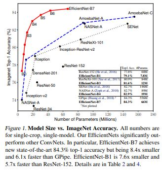
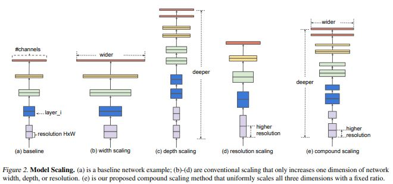
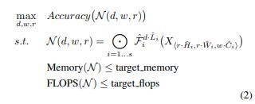
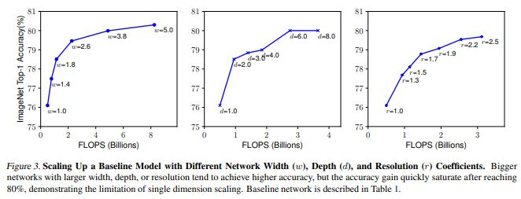
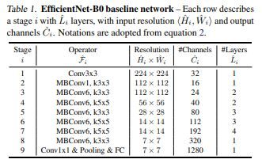
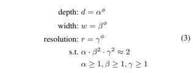
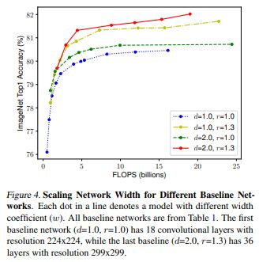

# EfficientNet: Rethinking Model Scaling for Convolutional Neural Networks

> **Abstract**
> 
- 논문의 저자는 `Model Scaling` 방법을 연구하고 Network의 `Depth`, `Width`, `Resolution` 사이의 균형이 더 좋은 성능을 이끈다는 것을 확인한다.
- 이러한 관점에서 입각하여, 새로운 Scaling Method 제안한다. 간단하지만 효과적인 `Compound Coefficient` 사용하여 Depth/Width/Resolution의 모든 `Dimension` 균등하게 확장한다.
- Neural Network Search (NAS) 사용하고 새로운 Baseline Network 설계한다. 그리고 크기를 확장하여 같은 성질을 갖는 Networks 구축하고 **EfficientNets** 부른다. 해당 Networks는 이전의 ConvNets 보다 더 정확하고 효율적이다.

> **Introduction**
> 

- ConvNet의 크기를 확장하는 방법은 정확도를 달성하기 위해 사용되었다. 그러나 이 과정은 잘 알려져 있지 않았고, 이를 위한 많은 방법들이 존재한다.
- 가장 흔한 방법은 ConvNet의 `Depth` 조절하는 방법이다. 또 다른 방법은 Iamge의 `Resolution` 늘린다.
- 비록 마음대로 (Depth/Width/Resolution) 2개 또는 3개의 Dimension 늘리는 것은 가능하지만, 이런 방식은 반복 작업이 필요로 하고, 차선의 정확성과 효율성을 생산하는 경우가 많다.
- 저자들은 `Scaling up` 과정에 대해 다시 생각하였고, ConvNets 정확도와 효율성을 달성하기 위한 원칙 방법을 조사하였다. 그 결과 (Width/Depth/Resolution)에 대한 **Balance**가 핵심이며, 간단한 `Constant Ratio` 통해 달성할 수 있다.
- **Compound Scaling Method** (고정된 Scaling Coefficients에 대해 균일하게 3dims 조절하는 방법)
- Compound Scaling Method 당연한 방법이다. 왜냐하면 Image의 Input이 커질 수록 Receptive Field에 대해 더 많은 Layer 필요하며 Pattern 잡기 위해 더 많은 Channel이 필요하기 때문이다.
- **Efficient-B7** 경우 존재하는 **GPip** 정확도를 능가하면서 `8.4x` 더 적은 Parameter 사용하며 Inference 속도가 빠르다.

> **Compound Model Scaling**
> 
- 다른 접근 방식으로 Scaling 문제를 공식화 한다. 그리고 새로운 Scaling 방법을 제안한다.

**Problem Formulation**

- ConvNet Layers 여러 단계로 분할 되고 각 단계의 모든 Layer 동일한 Architecture 공유한다.

$Ν = ΘF_i(X_{H_i,W_i,C_i})$

- 가장 좋은 Layer Architecture F(x) 찾는 것을 집중하는 기존 ConvNet과 달리, Baseline Network의 F(x) 고정하고 `length(L)`, `width(C)`, `resolution(H, W)` 변경한다.
- F(x) 고정하면서, 새로운 제약 조건에 대해 Model Scalings 방법은 간단하게 만들어 설계 문제를 해결 할 수 있다. 그러나 여전히 각 Layers 대해 많은 `Design Space`가 남아있다.
- 이러한 Design Space 줄이기 위해, 모든 Layer가 Constant Ratio에 균등하게 조정될 수 있도록 제한한다.

**Scaling Dimensions**

- 위 수식에서 가장 큰 문제는 d, w, r에 대해 서로 의존적이며 다른 제한 조건에 의해 각 변수가 변경된다는 점이다.

**Depth (d) :**

- Network의 `Depth` 조절 하는 방법은 많은 ConvNet에서 흔한 방법이다. 직관적으로 ConvNet이 깊어질 수록 더 많고 복잡한 Feature-map 확인 할 수 있고 Task에 대해 일반화가 잘 된다.
- 그러나 Network가 깊어질 수록 `Vanishing Gradient` 문제가 발생하고 이를 해결하기 위한 방법들이 따라왔다. (Skip Connection etc)
- 넓은 Network는 더 많은 정제된 Feature-map 볼 수 있고 학습하기도 쉽다.  그러나 넓고 얇은 Network는 더 높은 단계의 Feature-map 확인 할 수 없다.

**Resolution (r) :**

- 높은 해상도인 Input Image에 대해, ConvNets 더 많은 정제된 Patterns 볼 수 있다.
- 224 x 224 시작하여 현재 ConvNet은 299(331) x 299(331) 사용하는 경향도 있다.

<aside>
📌 **Observation 1**
Network의 `width`, `depth`, `resolution` Dimension 조절하는 방법은 정확도 측면에서 향상이 있다. 하지만 큰 모델에 비해서 정확도가 좋지 않았다.

</aside>

**Compound Scaling**

- 직관적으로 높은 해상도의 이미지가 있다면, Network Depth 증가 시켜야 한다. 그래야 큰 Receptive Field는 큰 이미지 픽셀에 대해 비슷한 Feature 추출할 수 있다.
- 이와 상응하여 Network의 Width 증가 하였다. 이러한 관점들은 단일 Dimension Scaling 보다 여러 Diemension에 대한 Balance 제안한다.

<aside>
📌 **Observation 2**
더 좋은 정확도와 효율성을 달성하기 위해서 ConvNet Scaling 할 때, Network의 Depth, Width, Resolution의 `Balance` 중요하다.

</aside>

- 따라서 `Compound Scaling Method` 제안한다. 이 방법은 `Compound coefficient Φ` 사용하여 Network (width/depth,resolution) 조절한다.

- `α`, `β`, `γ` 상수는 small grid search에 대해 결정된다. 직관적으로 `Φ` 는 Model Scaling에 사용할 수 있는 자원을 제어 하는 user-specified coefficient 이며, α, β, γ는 Network의 width, depth, resolution에 자원을 할당하는 방법을 말한다.

> **EfficientNet Architecture**
> 

- Baseline Network의 Layer Operators F(x)는 Model Scaling에서 고정되기 때문에 좋은 Baseline Network 획득하는 것이 중요하다. 이에 대해 NAS 통하여 선정하였다.
- 해당 연구는 **EfficientNet-B0** 효율적인 Network 생산한다. 같은 Search Space 탐색 했기 때문에 해당 구조는 **MnasNet**과 비슷하지만, EfficientNet-B0가 `FLOPs` target 때문에 약간 더 크다.
- Main Block은 `Mobile Inverted Residual Bottleneck`  사용하였으며, `Squeeze-and-Excitation module` 또한 사용하였다.

**STEP 1** → Φ = 1 고정한 상태에서 α, β, γ 찾는다.

**STEP 2** → 찾은 α, β, γ에 대해서 Φ 값을 변경한다.

> **Conclusion**
> 
- 정확도와 효율성을 유지하면서 Network의 width, depth, resolution의 Balance 설정하는 방법을 연구하였다.
- Compound Scaling Method 제안하고, 쉽게 자원 제약 없이 Model Scaling 진행 할 수 있다. 제작한 **EfficientNet Model**은 효과적으로 Scaling 될 수 있다.