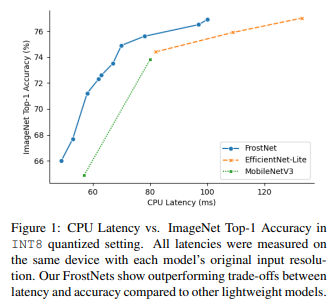
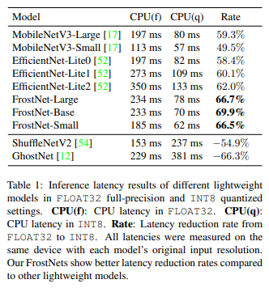
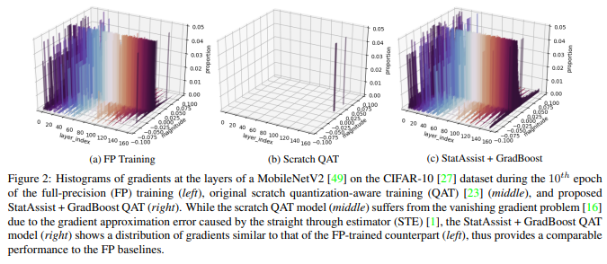
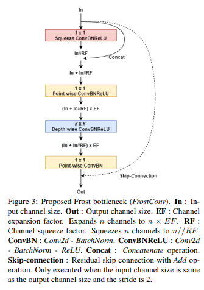
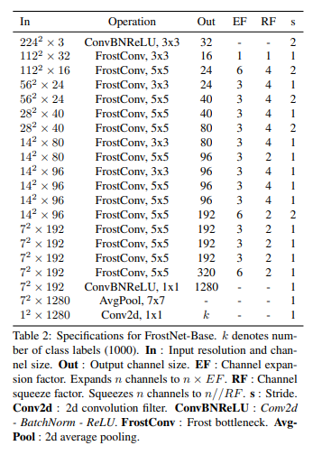

# FrostNet: Towards Quantization-Aware Network Architecture Search

> **Abstract**
> 
- Edge-dvice에서 CNNs 동작 시키기 위해  메모리와 연산 자원을 줄이는 용도로 사용되는 `INT8 quantization`은 기본적인 기술이 되었다.
- 저자는 새로운 Network Architecture Search(NAS) 통해 `full-precision(FLOAT32)`와 `quantized(INT8)` 둘 다 보장하는 Network 발견하였다.
- `quantization aware training(QAT)`와 `stochastic gradient bossting` 가능하게 하는 중요하지만 간단한 최적화 방법을 제안한다.
- 이를 통해 quantization에 효율적인 Network Building Blocks(**Frost BottleNeck**) 발견하였고, 이 Blcoks 사용하여 quantization에 효율적인 Network(**FrostNet**) 만들었다.

> **Introduction**
> 

- 깊은 모델에 대해 `weight`과 `activation`에 대해 Quantization 적용하는 방식은 모델 연산을 줄이는 약속된 접근이다.
- `scale (INT8)` quantization은 latency에 대한 애플리케이션의 성능을 향상 시킨다. 그리고 Edge-device의 Network 고려할 때, 기본적인 기술이 되었다. 하지만 실제 수행은 Network Architecture에 의존하여 quantization varies 획득 된다.
- `weight layer`의 quantization statistics 고정되어 있지만 `normalization`과 `activation layer`의 quantization statistics는 input에 따라 지속적으로 변화한다.
- **FrostNet**은 `INT8 환경`에서 `accuracy`와 `latency` 사이의 Trade-off 뛰어남을 보장한다.
    - 안정적이고 비용을 절감하는 QAT 도입하기 위해 floatting-point statistic assisting과 stochastic gradient boosting 사용한다.
    - StatAssist와 GradBoost QAT 다양한 NAS 알고리즘으로 결합하여, 새로운 FrostNet 만들었다.
    - mobile target 제작된 backbone feature extractor에 대해 FrostNet 대체하면 더 좋은 성능을 얻을 수 있다.

> **Background**
> 
- `hardcrafted structure`와 `NAS`는 device에서 latency와 power consumption 줄이기 위해 효과적인 역할을 해왔다.

**Efficient Mobile Building Blocks**

- MobileNetv1은 Depth-wise separable convolution 도입하였다.
- MobileNetv2는 mobile building blocks 향상 하여 Inverted residual 구조를 만들었다.
- MnasNet은 inverted residual bottleneck에 squeeze and excitation 추가하였다.
- EfficientNet은 MnasNet 구조에 swish activation 적용하였다.
- 하지만 Efficient-Lite에서 SE Blocks과 swish 제거 되었고, `post-quantization` 방법이 도입되었다.

**Network Architecture Search**

- 최근 자동적으로 구조를 설계하기 위해서 **network architecture search(NAS)** 도입하였고 시도와 오류 측면에서 인간의 소비를 감소 시켰다.
- **Reinforcement Learning(RL)** 처음 중요한 요소로 도입되어 Accuracy 측면에서 효율적인 구조를 탐색할 수 있게 만들었다.
- 연산 비용을 감소 시키기 위해서 `gradient-based NAS` 알고리즘을 사용하였고, layer-wise 측면에서 `hardward-aware NAS` 알고리즘을 사용하여 효율적인 구조를 만들 수 있게 하였다.

**Network Quantization**

- Network Quantization은 대략적으로 `weight parameter` (W ∈ R)와 `activation` (a ∈ R) 필요로 하며 각각 R과 Rq는 FLOAT32와 INT8 `precision`이다.

**Static Quantization**

- network quantization 진행하는 것은 쉽지 않다. 가장 큰 이유는 `activation a` 때문이다. inference 시간에  `value W`가 고정 되기 때문에 쉽게 quantization 통계를 얻을 수 있다. 하지만 `activation S(a)` input 값에 의해 쉽게 변하기 때문이다.
- 따라서 동적으로 quantization 통계를 계산하는 것 대신에, 미리 계산해 놓는 것이 문제를 해결하기 위한 방법이고 이를 static quantization 이라고 부른다.

**Quantization-Aware Training**

- post-quantization 에서 수행 정도를 올리기 위해 **quantization-aware training (QAT)** 제안하여 Network parameter 들을 fine-tune 한다. QAT는 convolution blocks에 `fake-quantization module` 적용한다.
- QAT 최적화 하는 방법은 대략적인 오류가 `fake-quantization`(straight through estimator)에서 발생하기 때문에 적합하지 않다. 따라서 이를 보완하는 방법이 필요하다.

> **StatAssist and GradBoost**
> 

- QAT 실패하는 2가지 요인을 다룬다.
    - Gradient approximation error
    - gradient instability from the inaccurate initial quantization statistics

**Gradient Approximation Error**

- quantity g(W) 통해 gradient 계산할 경우 $W_{t+1} = W_t + ηg(W_t) + βm_t$ 수식이된다.
    - $`m_t`$ : 이전 time-step에 대한 momentum 축적 값을 말한다.
    - `η` :  model 학습 시에 learning_rate 관리한다.
- $g(W_{t,q})$  계산할 경우, 거대한 근사치 발생하고 downstream layer 통과하는 과정에서 gradient vanishing 문제가 발생한다. 부정확한 계산은 오차 업데이트를 발생하고 이러한 현상이 반복되어 오류가 발생한다.
- 논문에서 제시한 피드백은 `gradient update error` 줄이고 좋은 정확성을 축적한다.
- 따라서 single epoch 축적된 `momentum` 제시하고 이를 통해 gradient approximation error 학습 시간에 조절하기에 충분하다고 생각한다. (= **StatAssist**)

**Stochastic Gradient Boosting**

- 제안한 StatAssist 사용하지만 정확하지 않은 quantization 때문에 지역 최솟값으로 gradient가 수렴할 가능성이 존재한다.
- QAT 단계의 Local-Minima 빠지는 것을 방지하기 위해 수정한 weight update 방식을 제안한다.

$b_{W,t} = EM^{max}_t(g(W_q)) - EM^{min}_t(g(W_q))$

- 이러한 `GradBoost` 통해 쉽게 수식이 결합 되고, **stochastic gradient descent(SGD) Optimizer**에 추가 된다.

**Optimal INT8 QAT from Scratch**

- `StatAssist`와 `GradBoost`가 quantized된 가벼운 모델에 대해 효과적으로 수행하는 것을 증명했다.
- scratch QAT가 모델이 복잡해질 경우 사전 훈련된 weight 도움 없이 비슷한 정확도와 성능을 보이는 것을 발견했다.

> **FrostNet**
> 
- `width`, `depth`, `resolution` 변경하는 방법은 Networks 효율성을 증가 시켜 accuracy와 latency 사이의 Trade-off 조절한다. 하지만 이는 여전히 작은 단계에서 조절하는 방안이다.
- squeeze-and-excite(SE)와 swish 또한 모바일 환경에선 적합하지 않으며, layer fusion 단계에선 `Conv-bn` or `Conv-bn-relu` or `Conv-relu` 구성하는 것이 가장 Quantize 적용하기에 효율적이다.
- 따라서 **Frost Conv** 제작하고 이는 MBConv Block에 SE Module과 비슷한 방식을 추가한 것이다.

**NAS Based Block Design**

- 우선 `StatAssist`와 `GradBoost` 사용하여 gradient 기반인 **NAS**와 **PDARTS** 통해 SE module 대체할 수 있는 후보군을 찾았다.
    - Concat 제거하여 CPU Inference 동안 메모리 접근 빈도를 줄였다.
    - Max_Pool 사용한다. Avg_Pool 경우 QAT setting에서 오류를 발생 시킨다.
    - $k-2^{th}$ cell 제거한다.
    - main convolution module의 핵심을 선택한다
    - $k-1^{th}  \quad ->\quad k^{th}$ feature map concat하여 모델 사이즈를 줄인다.
    - minimum channel size 8로 고정한다.
- 이렇게 block 후보군이 찾아지면 기존 사용되는 block 비교하여 prototype 찾았다.

**Blocks Specification**

- **Frost Bottleneck** 경우 Inverted Residual Blocks 기반을 두고, SE module에 대해 **SC module**로 변경한다. 이는 SE module 처럼 작동한다.

**Architecture Search**

- **NAS(StatAssist + GradBoost)** 사용하여 QAT 환경을 구축하고, Reinforcement Learning(`RL`) 기반목적 함수를 사용하여 Frost Conv로 Building Blocks 구축했다.

**Architecture Specification**

> **Conclusion**
> 
- 논문에서 quantization-aware network architecture(NAS) 접근으로 full-precision(`FLOAT32`)에서 quantized(`INT8`) 변환을 보장하는 Networks 찾았다.
- 따라서 **FrostNet** 좋은 Network 개발하였으며 여기서 사용된 **FrostConv** 가장 좋은지는 가능성이 아직 열려있다.