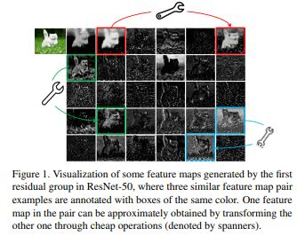
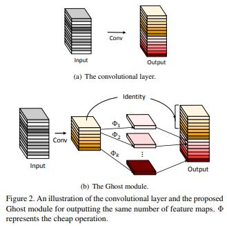
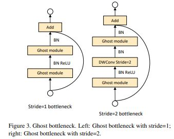
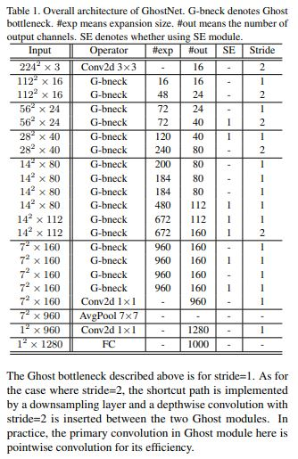

# GhostNet: More Features from Cheep Operations

> **Abstract**
> 
- Convolutional Neural Networks (CNNs) Embedded Device에 배치하는 것은 `Limited Memory`와 `Computation Resource` 환경 때문에 어렵다.
- 논문에서 간단한 연산으로 많은 Feature-map 추출할 수 있는 **Ghost Module** 제안한다. Intrinstic Feature-map의 집합을 기반으로, 저자는 간단한 연산을 Linear Transformation 연속에 적용하여 많은 Ghost Feature-map 만들어 낸다. 이 Feature-map은 본질적인 특징의 기초가 되는 정보를 드러낼 수 있다.
- 언급한 Ghost Module은 `plug-and-play` 요소로 장착되어, 기존 Convolutional Neural Network 발전 시킬 수 있다.
- Ghost Module 쌓아서 Ghost bottleneck 설계하고, 이를 통해 가벼운 **GhostNet** 만들 수 있다.

> **Introduction**
> 

<aside>
📌 [Knowledge Distillation]
미리 잘 학습된 큰 네트워크(Teacher Network)의 지식을 실제로 사용하고자 하는 작은 네트워크(Student Network)에게 전달하는 것.
- Computing Resource
- Energy
- Memory

</aside>

- 전통적인 CNNs은 만족스러운 정확도를 달성하기 위해 많은 Parameter와 Floating point operations (FLOPs)가 필요하다. 따라서 최근 Deep Neural Network 설계에 관한 경향은 Mobile device에 수행 가능하도록 효율적인 Network 구조를 연구하는 것이다.
- "Han"은 Nueral Network에서 중요하지 않은 Wegiht 가지를 치는 것을 제안했다. 그러나 이러한 방법들의 수행 능력은 그들이 baselines 잡은 pre-trained Network에 기반한다.
- 잘 학습된 Network의 풍부한 Feature-map 정보는 Input Data 이해를 보장한다. 하지만 **Figure 1**처럼 중복된 Feature-map (Ghost) 보는 상황이 발생한다. 이런 풍부한 Feature-map 피하는 것 대신에 저렴하게 이것들을 보강한다.
- Output Feature-map 크기 변경 없이, Ghost Mudle에선 필요한 Parameter 수와 연산 복잡도가 감소된다. 이러한 모듈에 입각하여 효율적인 구조인 **GhostNet** 제작하였다.

> **Approach**
> 

저자들은 적은 Fileter 사용하여 많은 Feature-map 만들어내는 Ghost Module 처음 도입하였다. 그리고 GhostNet 발전 시켰고, 매우 효율적이며 높은 성능을 낸다.

**1. Ghost Module for More Features**

- Deep Convolutional Neural Networks 다수의 Convolution 구성되어 있으며, 많은 연산을 동반한다. 비록 최신 연구가 CNNs의 작은 Conv Filter 사용하여 효율적인 구조를 만들려고 하지만 여전히 1 x 1 Convolution은 상당한 `Memory`와 `FLOPs` 차지한다.
- Figure1 결과로 볼 때, Convolution Layer의 Output Feature-map은 풍부하고 서로 비슷한 성질을 갖고 있다. 여기에 중점을 두어 풍부한 Feature-map의 불필요한 부분 때문에 FLOPs와 Parameter가 늘어 난다고 생각했다
- `n` Feature-map에 대해 간단한 Linear 연산을 각 Feature에 적용하여 Ghost Feature 추출한다.

$y_{ij} = Φ_{i, j} (y'_i)    \quad ∀ \quad i=1,...,m, \quad j=1, ...s$

- Linear 연산인 `Φ` 각각의 Channel에 대해 동작하며 일반적인 Convolution 연산 보다 연산이 간단하다.

**Difference from Existing Methods**

ⅰ1 x 1 Pointwise Convolution 사용하는 개체들과는 달리 Ghost Module은 `Kernel_size`에 대해 `Customizing` 할 수 있다.

ⅱGhost Module은 일반적인 Convolution 사용하여 먼저 몇 개의 고유한 Feature-map 생성하고, 가벼운 `Linear Operations` 활용하여 Feature 확장하고 Channel 늘린다.

ⅲ Feature-map 처리하기 위해 이전에선 Depthwise, shift 연산을 사용한 반면, Ghost Module의 Linear Operations 큰 다양성을 가질 수 있다.

ⅳ `instrinsic Feature-maps` 보존하기 위해 `identity mapping`은 Ghost Module의 `Linear Transform`과 병렬로 연결된다.

**Analysis on Complexities**

- 이미 존재하는 구조에 Ghost Module 쉽게 추가하여 연산 비용을 줄이려고 노력했다.
- $n (s-1)$ Linear Operation은 다양한 `shape`과 `parameter` 취할 수 있다. 하지만 CPU/GPU 기반인online inference 측면에서 방해가 될 수 있다.
- 따라서 (3 x 3, 5 x 5) 같은 size인 Linear Operation 제안한다.

**2. Building Efficient CNNs**

- `Ghost bottleneck(G-bneck)` 도입하여 작은 CNNs 설계한다. 제안한 Ghost bottleneck 2 개의 `Ghost Modules` 쌓아 올려 구성한다.
- 첫 번째 Ghost Module은 `Expansion Layer` 사용하여 Channel 수를 늘린다.
- 두 번째 Ghost Module은 Channel 수를 줄여 `Shortcut path` 맞춘다.

**GhostNet**

- 모든 Ghost bottlenecks `stride=1` 적용한다. 각 stage 마지막에만 `stride=2` 적용한다.
- `squeeze and excite(SE)` module 또한 Ghost bottleneck의 Residual Layer에 적용한다.

**Width Multiplier**

- 비록 주어진 구조가 low latency 하고 accuracy 보장하지만 더 작고 빠르면서 높은 정확도를 같은 구조가 필요할 경우가 발생한다.
- 따라서 `α` width multiplier 도입하여 각 채널에 적용하고 전체적인 Network의 width 수정한다.

> **Conclusion**
> 
- 기본적인 Ghost Module은 기존 Convolution Layer 쪼개어 두 부분으로 구성한다. 그리고 몇몇 Filter의 Instrinsic Featuer-maps 발생 시킨다.
- 따라서 제안한 Ghost Module 사용하여 GhostNet 만들었고 `State-of-the-Art` 달성했다.