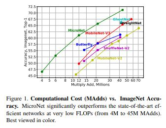
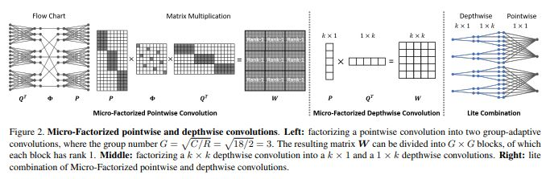
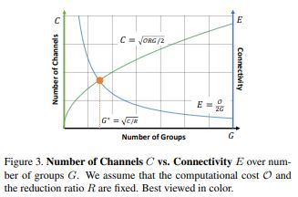
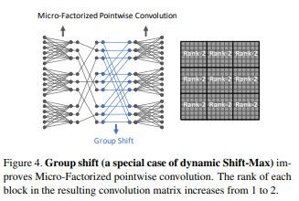
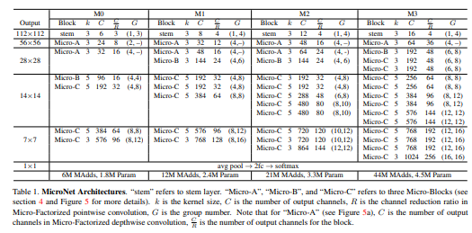
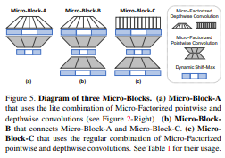

# MicroNet: Towards Image Recognition with Extremely Low FLOPs

> **Abstract**
> 
- 저자들은 **MicroNet** 매우 낮은 연산을 사용하여 ****효율적인 Convolution Neural Network 제시한다.
- 저자들은 2가지 원칙에 입각하여 Low `Flops` 다룬다.
    
    (a) `Node Connectivity` 낮춤으로써, Network의 `Width` 줄이는 방향을 피한다.
    
    (b) 복잡한 `Non-linearity Layer`마다 사용하여, Network `Depth`에 대한 보상으로 작동시킨다.
    
- 첫 번째로 **Micro-Factorized Convolution** 제안하여 `Pointwise` and `Depthwise` Convolution 연산에 대해 낮은 차원으로 분해하여 Channels 수와 Input/Output Connectivity에 좋은 `Trade-off` 생성한다.
- 두 번째로 **Dynamic Shift-Max** 새로운 Activation Function 제안한다. 이 함수는 Input Feature-map과 그것의 Channel 방향으로 순회된 Feature-map 사이의 `Dynamic Fusions`의 `Non-linearity` 향상한다.
- Fusions는 Input에 대해 Parameters가 적응되어 갈 때 마다 동적으로 변화한다.

> **Introduction**
> 

- 최근, CNN Architectures 효율적으로 설계하는 연구가 진행되고 있다. 이러한 연구는 Edge device에서 높은 질의 서비스가 가능하게 만들었다.
- 해당 논문에서 MobileNetv3 보다 절반의 예산을 갖고 Image Classification(1000 classes)에 도전하기로 했으며 Resolution은 224 x 224 이고 이를 `6MFpos` 아래로 진행하는 것이다.
- 매우 낮은 연산을 진행하는 방식은 모든 Layer 설계함에 있어서 주의를 필요로 한다. 이러한 낮은 예산에 집중하여 MobileNet과 ShuffleNet은 Network의 `Width`와 `Depth` 줄이는 방식으로 접근하는데, 이는 성능 측면의 감소를 불러온다.
- 저자는 Pointwise와 Depthwise Convolution에 대해 저 차원으로 **Micro-Factorized Convolution** 적용한다. 이는 Input/Output Connectivity와 Channels 사이의 균형을 제공한다.
- Pointwise Convolution에 대해 `Group-Adaptive Convolution` 적용하고, Depthwise Convolution에 대해 k x k (kernel)에 대해 `1 x k` or `k x 1` 적용한다.
- 다른 단계에서 적합한 결합은 Channels 희생 없이 연산 비용을 절감 시킨 다는 것을 보여준다.
- 2가지 측면에 대해 `Non-linearity` 향상 하는 **Dynamic Shift-Max** 새로운 Activation Function 제안한다.
    
    (a) Input Feature-map과 Circular Channel Shift 사이 Multiple Fusions 최대화 한다.
    
    (b) Input에 대해 Parameter가 정해지면 이러한 Fusions 동적이다.
    

> **Our Method: MicroNet**
> 

**Design Principles**

- Low FLOPs 접근은 Network의 `Width` (number of channels)와 `Depth` (number of layers) 제한한다.  Graph 관점에서 저자는 `Connectivity`에 대해 output node의 연결 수로 정의한다.
- 따라서 연결 수는 output의 channels과 connectivity 수와 같다.
- Computation cost 고정되어 있다면, 이러한 Channel 수는 Connectivity와 마찰이 생긴다. 따라서 그들 간의 좋은 균형은 Channel 감소를 피하고 Layer Feature 향상 시킨다고 믿는다.
- 그러므로 **Circumventing the reduction of network width through lowering node connectivity** 원칙이 등장한다.
- Network 줄이는 관점에서 Depth는 중요하다. ReLU와 같은 활성화 함수를 Encode 시킬 때 성능 저하를 발생할 수 있다.
- 따라서 **Compensating for the reduction of network depth by improving non-linearity per layer** 원칙이 등장한다.

**Micro-Fatorized Convolution**

- 저자는 Pointwise와 Depthwise Convolution `finer scale` 분해한다. 이 목적은 Channels 수와 Input/Output Connectivity 사이의 균형을 위하는 것이다.

**Micro-Factorize Pointwise Convolution :** 

- Pointwise Convolution에 대해 Group-Adaptive Convolution 분해할 것을 제안한다. Convolution kernel `W`  값을 Input/Output Channels와 같게 추정한다.
- kernel marix `W` 2개의 Group-Adaptive Convolution 분해되며, 각각의 Group `G`는 Channels `C`에 달려있다.

$W = PΦQ^T \quad \quad G = \sqrt{C/R}$

**Micro-Factorized Depthwise Convolution :** 

- `k x k` Depthwise Convolution에 대해 `k x 1` kernel, `1 x k` kernel 진행한다. 이는 Micro-Factorized Pointwise Convolution과 같은 수학적 양식을 공유한다.

**Combining Miro-Factorized Pointwise and Depthwise Convolutions :** 

(a) Regualr Combination

(b) Lite Combination

- 2 가지 방법으로 결합한다. 전자는 2 Convolution에 대해 Concat 진행하고, 후자는 Channels 확장하여 Channels 공간적 방향에 연산을 진행한다.
- Lite Combination의 경우 더 Low Level에서 효과적이며 더 많은 Channels Fusion 담을 수 있다.

**Dynamic Shift-Max**

- Dynamic Shift-Max는 Group 간의 연결을 강화 시킬 수 있다. 이는 `Group`간의 연결에 집중한 Micro-Factorized Pointwise Convolution 통해 완성된다.

**Non-Linearity**

- Dynamic Shift Max 2가지 `Non-Linearity` 통해 만들어 질 수 있다.
    
    (a) J Groups에 K Different 만큼 Output 극대화
    
    (b) Parameter(x)는 input(x)에 대한 Function
    
- 이러한 방식은 Layer 수를 줄이는 방법에 대한 강한 보상을 제공한다.

**Connectivity**

- Dynamic Shift Max는 Channel Group 간의 연결을 향상 시킨다.

**Computational Complexity**

- 연산의 복잡한 정도는 3가지로 구분된다.
    
    (a) Average Pooling
    
    (b) Generating Parameter
    
    (c) Apply Dynamic Shift-Max per Channels
    

**Relation to Prior Work**

- MicroNet은 MobileNet과 ShuffleNet에 대해 Convolution과 Activation이 다르다.
- Pointwise Convolution 관해 Group-Adaptive Convolution 나누고, 여기서 `G` 는 위의 수식을 따른다. 그리고 Depthwise Convolution 적용하고 Channel Connectivity 고려한 Activation 적용한다.

> **MicroNet Architecture**
> 

- MicroNet은 3가지 Type의 `Micro-Blocks` 사용하며 모두 `Dynamic-Shift Max` Activation 함수를 사용한다.

**Micro-Block-A**

- Micro-Block-A의 경우 Micro-Factorized Pointwise와 Depthwise Convolution의 Lite Combination이루어져 있다.

**Micro-Block-B**

- Micro-Block-B는 Block-A와 Block-C 연결하는데 사용된다. A와 다른 점은 2가지 Group-Adaptive Convolution 포함한다는 것이다.
- 전자는 `Channel Squeeze` 하고 후자는 `Channel Expand` 한다. Micro-Block-B 경우 MicroNet 당 한번만 사용된다.

**Micro-Block-C**

- Micro-Factorized Depthwise와 Pointwise Convolution에 대해 `Concate` 결합하는 Block 이다.
- 만약 Dimension이 맞지 않는 다면 `Skip Connection` 사용한다.

> **Conclusion**
> 
- 낮은 연산 비용을 갖는 **MicroNet** 소개한다.
- MicroNet은 Micro-Factorized Convolution과 Dynamic Shift-Max 기반으로 제작된다.