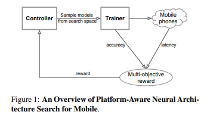
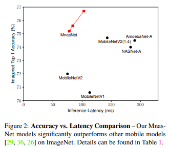
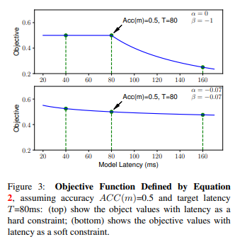
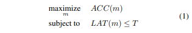
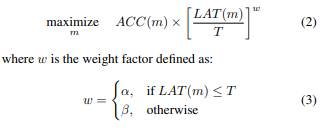
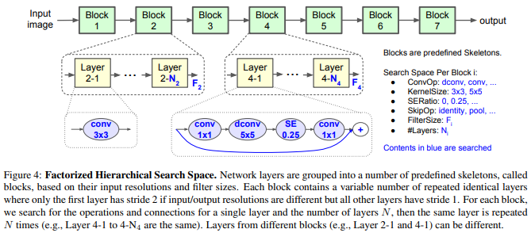
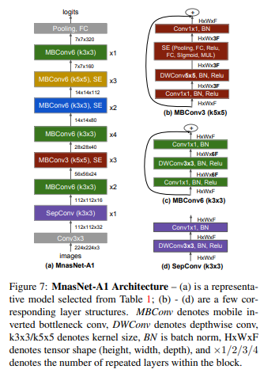

MNASNET# MnasNet: Platform-Aware Neural Architecture Search for Mobile

> **Abstract**
> 
- Mobile CNNs의 모든 `Dimension` 설계와 향상을 위한 많은 노력들이 진행되어 왔지만, 많은 Architecture 고려 될 수 있기 때문에 `Trade-off` 사이의 균형을 맞추긴 어렵다.
- 해당 논문에서 모델의 Latency에 목적을 맞춘 **mobile neural architecture search (MNAS)** 접근을 통해 `Accuracy`와 `Latency` 간의 좋은 Trade-off 균형을 갖는 모델을 찾는다.
- 따라서 Network 전반적으로 Layer의 다양성을 장려하는 새로운 **Factorized Hierarchical Search Space** 제안한다. (= **MNasNet**)

> **Introduction**
> 

- 현대 CNNs 모델은 깊어지고 넓어지고 있다. 그렇기 때문에 느려지고 더 많은 연산을 필요로 한다. 하지만 연산에 대한 증가는 자원 제한 적인 `mobile` 및 `embedded device` 환경에서 최고 성능을 가져오긴 어렵다.
- Mobile CNNs 향상 하기 위해 Network의 `Depth` 줄이거나 `Depthwise Convolution` 및 `Group Convolution` 적용하는 경우가 있었다.
- 논문에선 automated neural architecture search 사용하여 Mobile CNNs 설계하는 방법을 제안한다.  해당 접근은 2 가지 핵심 아이디어에 기반을 두고 있다.
- 첫 번째로 `Accuracy`와 `Latency` 둘 다 최적화 하는 관점에서 설계 문제를 공식화 한다. 이 생각은 `FLOPs`가 종종 부정확한 지표가 된다는 점에 영감을 받았다.
- 두 번째로 이전에 automated approaches 탐색한 `cell` 관찰하고 반복하여 같은 cell 쌓아서 `Network` 구성한다. 이를 통해 새로운 Factorized Hierarchical Search Space 제안한다. Layer의 계층 구조는 다르지만  `flexiblity`와 `search space` 사이의 균형을 이루어야 한다.
1. **Multi-Objective Neural Architecture serach (MNAS)** 도입하여 mobile device 환경에서 accuracy와 latency 최적화 한다.
2. 새로운 **Factorized hierarchical search space** 제안하고 Layer 다양성을 가능하게 하고 flexibility와 search space size 균형을 만든다.
3. ImageNet과 COCO Object Detection에서 새로운 **SOTA** 만들었다.

> **Problem Formulation**
> 

- multi-objective search 관점으로 설계 문제를 공식화 하였다. 이를 통해 높은 정확도를 갖고 추론 시간이 적은 CNN 모델을 찾는 것을 목표로 한다.

- 주어진 수식에서 `m` 은 Model 이고 , `ACC(m)`은 목적에 맞는 정확도를 지칭한다. `LAT(m)`은 지정된 mobile platform에서 추론 시간을 나타낸다. 그리고 `T`는  목적의 추론 시간이다.
- 하지만 위와 같은 접근은 단일 Metric에서 극대화 되며 **multiple Pareto-optimal Solution** 제공하진 않는다.
- 따라서 Architecture의 수행 연산에 대한 연구를 통해 단일 Architecture에서 multiple Pareto -optimal solution 발견하려고 노력했다.

> **Mobile Neural Architecture Search**
> 
- 이번 Section에선 새로운 `Factorized Hierarchical Search Space`에 대해 논의하고, Search Algorithm의 기반인 `Reinforcement-learning` 요약해보려고 한다.

**Factorized Hierarchical Search Space**

- 대부분 이전의 Search Space에 대한 연구는 복잡한 `cell`에 대한 연구가 아니라 반복하여 같은 `cell` 쌓는 관점으로 진행되었다.
- 대조적으로, 저자는 고유 `Blocks` 사용하여 새로운 Factorized Hierarchical Search Space 안에서 CNN 모델을 분해하였다. 따라서 다른 `Blocks` 사용되기 때문에 다른 `Layer Architectures` 갖는다.
- 연산에 대한 제약 조건이 존재한다면, Kernel_size `K`와 Filter_size `N` 사이의 균형이 필요하다. Receptive Field에 큰 Kernel_size 적용 한다면 Filter_size 줄여서 대응해야 연산이 보존된다.
- CNN 모델을 미리 정의한 Blocks 흐름으로 나누고 점진적으로 input resolution 줄이면서 CNN 모델의 Filter_size 늘려나갔다.
    - `Convolutional ops` : regular conv, depthwise conv, inverted bottleneck conv
    - `Convolutional kernel size` : 3 x 3, 5 x 5
    - `Squeeze-and-excitation ratio` : 0, 0.25
    - `Skip ops` : pooling, identity residual
    - `Output filter size` : F
    - `Number of layers per block` : N

**Search Algorithm**

- multi-objective search problem에 대해 **Pareto optimal solution** 찾으려 Reinforcement learning approach 사용하였다.
- Search Space 안으로 CNN 모델을 `Tocken`화 하여 리스트를 구축했다. 이러한 Token은 Reinforcement Learning의 Sequence에 의해 결정된다.

$J=E_p({a_1:T^Θ}) \quad[R(m)]$

> **Conclusion**
> 

- Reinforcement Learning 사용하여 Automated Neural Architecture Search 접근해 자원 제한적인 Mobile 환경에서 효율적인 구조를 찾는 방법을 제시한다.
- 논문의 핵심은 새로운 Factorized Hierarchical Search 과정을 통해 Mobile Model 찾고, Accuray와 Latency 사이 최고의 Tade-off 찾는 것이다.