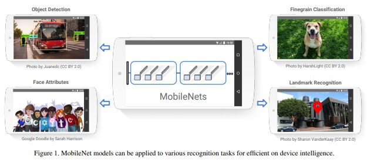
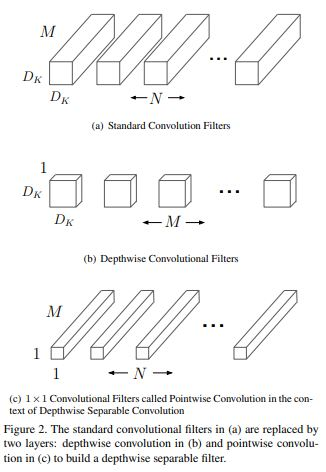
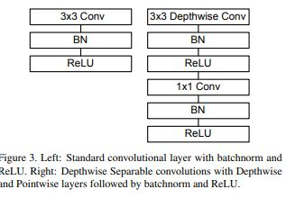
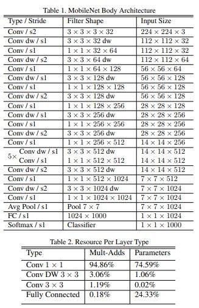

# MobileNets: Efficient Convolutional Neural Networks for Mobile Vision Applications

> **Abstract**
> 
- Mobile 및 Embedded application에서 효율적인 **MobileNets** 제시한다
- MobileNet은 `Depthwise Separable Convolution` 구성된 Streamlined Architecture 이며 경량 Deep Neural Network이다.
- 해당 논문에서 `Latency`와 `Accuracy` 위해  2개의 Global Hyper-Parameter 제안한다. 이러한 Parameter는 Application의 제한된 구조에서 Model의 메모리를 효율적으로 만든다.

> **Introduction**
> 
- 일반적으로 높은 Accuracy 달성하기 위해 Network 깊고 복잡하게 만드는 경향이 있다. 그러나 이러한 경향은 Network의 향상에 반드시 필요하지 않다. Network의 크기와 속도를 고려하지 않았기 때문이다.
- 세상의 Application은 연산에 의존적인 platform 기반으로 작동한다.
- 논문에서 효율적인 Network Architecture 설명하며, 2개의 Hyper-Parameter 통해 경량 및 낮은 Latency 갖는 Model 만든다. 이 Model은 쉽게 Mobile 및 Embedded Application에 대해 최적화 될 수 있다.

> **Prior Work**
> 
- 해당 논문은 제한된 자원 (Latency, Size) 갖는 Application에 Small Network 할당하는 것을 제안한다.
- MobileNets은 `Depthwise Separable Convolution` 처음 도입하였으며, 도입부의 Layer의 연산을 줄이기 위해 후에 `Inception Models` 차용한다.

<aside>
📌 Small Network Research → **Factorized Networks**, **Xception Network**, **Squeezenet**

</aside>

- 작성된 Small Network 다른 접근 방법으로 `Shrinking`, `Factorizing`, `Compressing Pretrained Network` 방법이 존재한다.

> **MobileNet Architecture**
> 
- MobileNet의 핵심 Layer는 `Depthwise Separable Filters`이다.
- 다음 MobileNet 구조는 `width_multiplier`와 `resolution multiplier` Hyper Parameters 갖는다.

**Depthwise Separable Convolution**

[Depthwise Separable Convolution 설명 및 pytorch 구현](https://wingnim.tistory.com/104)

<aside>
📌 **Depthwise Separable Convolution(Factorized Convolution)
=** Depthwise Convolution + Pointwise Convolution(1 x 1)

</aside>

- MobileNet은 각 Input Channel에 대해 단일 Depwise Convolution 진행한다. 다음 해당 Output 결합하기 위해 1 x 1 Convolution 진행한다.
- Depthwise Separable Convolution 2개의 Layer 나눠지며, 하나는 `Separate Layer for filtering` 다른 하나는 `Separate Layer for Combining`이다.
- Standard Convolution computation cost  : $D_K * D_K * M * N * D_F * D_F$
- Depthwise Convolution computation cost : $D_K * D_K * M * D_F * D_F$

<aside>
📌 하지만 Depthwise Convolution 경우 단순하게 Filter 연산만 진행한다. 이후 새로운 Feature 만들기 위해서 1 x 1 Convolution(Pointwise)가 필요하다.

</aside>

- Depthwise Convolution computation cost : $D_K * D_K * M * D_F * D_F + M * N * D_F *D_F$
- 3 x 3 Depthwise Separable Convolution의 경우 기존 Convolution 연산 보다 8~9배 연산이 적으며, Accuracy에 대한 차이가 없다.

**Network Structure and Training**

- MobileNet 구조는 **Table 1** 정의된다. 모든 Layer는 `BatchNorm` + `ReLU` 따르고 마지막 하단의 Fully Connected Layer만 non-linearity하게 Softmax Layer 전달된다.
- Down Sampling은 Convolution의 Stride 다뤄지며, Depthwise 및 First Layer에 적용된다.
- 마지막 Average Pooling 경우 공간적 Resolution `1`로 만든다. (FC 들어가기 위함)
- **Mult-Add** 수로 Network 정의하기에는 충분하지 않다.
- sparse matrix 연산이 dense matrix 연산 보다 빠르진 않지만 이를 1 x 1 Conv(Pointwise) 처리하여 연산에 대한 이점이 존재한다.
- 큰 Model 학습할 때와 대조적으로, `less regularization`과 `less data augmentation` 적용한다. 왜냐하면 Overfitting 문제에 빠질 수 있기 때문이다.
- `weight decay` 거의 적용하지 않는다. Depthwise Filter는 Parameter 수가 작기 때문이다.

**Width Multiplier: Thinner Models**

- MobileNet 구조도 이미 충분히 작고 지연이 적지만, 많은 Application은 더 작고 연산이 적게 걸리 방향을 필요로한다.
- 그래서 `α` 인 `width_multiplier` 도입한다. `α` 역할은 Network 균일하게 가볍게 만든다.
- Depthwise Separable Convolution (with multiplier α) computation cost : $D_K * D_K * αM * D_F * D_F + αM * αN * D_F * D_F$
- `α = 1 default` 기본적으로 연산을 적게 만든다. 또한 경량 모델에 대해 합리적인 이유로 사용이 가능하다.

**Resolution Multiplier: Reduced Representation**

- 두 번째 Hyper Parameter는 `ρ` 인 `resolution multiplier`이다. 저자들은 해당 값을 Layer의 Input에 넣어 사용하였다.
- Depthwise Separable Convolution (with Multiplier α, resolution Multiplier ρ) : $D_K * D_K *αM *ρD_F * ρD_F+αM * αN * ρD_F * ρD_F$

> **Conclusion**
> 
- 저자들은 효율적인 Model design 고려하였고, `Depthwise Separable Convolution` 사용하는 **MobileNet** 만들었다.
- `width_multiplier`와 `resolution_multiplier` 사용하여 더 빠른 MobileNet 만들었고, Size와 Latency에 대한 이점이 존재한다.