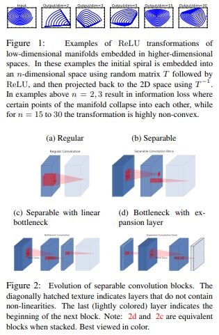
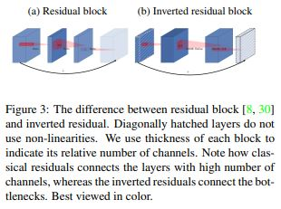
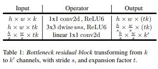
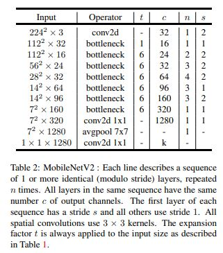

# MobileNetV2: Inverted Residuals and Linear Bottlenecks

> **Abstract**
> 
- 새로운 Mobile Architecture, **MobileNetV2** 제시한다.
- `Object Detection` 진행하기 위해 새로운 framework인 `MobileDeepLabv3` 사용하여 Mobile Model 효율적인 방법으로 제시한다.
- `Inverted Residual` 구조를 사용하여, `bottleneck` 구간에 `Shortcut Connections` 진행한다.
- 중간 Expansion Layer 대해 가벼운 `Depthwise Convolution` 적용해 non-lineartiy한 Feauture 추출한다.
- 그리고 narrow layer에서 non-lineartiy 제거하는 것이 Feature 잘 유지할 수 있음을 발견했다.
- 논문의 접근 방식은 Input/Output 도메인 분리를 허용하기 때문에 분석을 위한 framework에서 편리하게 작동한다.

> **Introduction**
> 
- Network의 정확도 향상을 위해선 항상 비용 측면이 따라온다 : 현재 `state of the art` Network는 Mobile 및 Embedded Application의 수용성을 넘어 높은 연산을 요구한다.
- 따라서 논문은 새로운 Neural Network 구조를 통해 Mobile 및 Resource 제한 환경에 대한 맞춤형 해결을 제안한다.
- 저자들은 새로운 Layer Module에 많은 중점을 두었다 : `Linear Bottleneck` 사용하는 `Inverted Residual Block`이다.
- 이 Module은 `Low-Dimensional Feature` 입력으로 받아 `High-Dimension` 확장하고, Depthwise Convolution 이용하여 Filtering 작업을 진행한다. 이 후, Feature는 Linear-Convolution 사용해 다시 `Low-Dimension` 투영된다.
- 이러한 Convolution Module은 특히 Mobile Design에 적합하다. 왜냐하면 Tensor 중간 단계로 복원하는 과정이 필요 없기 때문에 Memory Footprint 이점이 있기 때문이다.

> **Preliminaries, discussion and intuition**
> 

**Depthwise Separable Convolutions**

- `Depthwise Separable Convolutions Block`은 많은 효율적인 Neural Network 구조에서 사용하고 있으며, 논문의 저자들 또한 사용한다.
- 첫 번째 Layer는 `Depthwise Convolution` 진행하며, Input Channel에 대해 단일 Convolution Filtering 수행한다.
- 두 번째 Layer는  1 x 1 Convolution 진행하는 `Pointwise Convolution`이다. 해당 Layer는 Input Channels에 대해 Linear Combination 연산하여 새로운 Features 추출한다.
- `Depthwise Separable Convolution`은 다른 Layer 비해 연산을 줄일 수 있으며, **MobileNetV2**에서 `k = 3` → (3 x 3 Depthwise Separable Convolution)이다.

**Linear Bottlenecks**

- Real Image인 Input Set 갖고, Layer Activation 통과하면 **"Maniford of Interest"** 형성된다는 것을 안다. 그리고 이렇게 형성된 Feature는 Neural Network에서 `Low-Dimensional Subspace`에 들어가게 된다.
- 이러한 사실은 Layer의 Dimensionality 줄이거나, Operating Space의 Dimensionality 줄이면 알 수 있다.
- **MobileNetV1** 직관을 따르면서, `width_multiplier` 접근은 Features가 전체 공간에 들어가기까지 Activation Space의 Dimensionality 줄이는 것을 허락한다. 그러나 이러한 직관은 Deep Convolutional Neural Network가 `ReLU`와 같은 **활성화 함수(non-linear)** 사용하는 생각을 한다면 오류인 것을 알 수 있다.
- Deep Network는 `Non-Zero`인 Linear Classifier Output 도메인만 갖기 때문이다.

- 다시 말해 `ReLU` 통과할 때, 불가피하게 정보가 손실 될 수 있다는 것을 말한다. 그러나 만약 Channel 개수가 많다면 Activation 통과하더라도 Manifold 정보는 다른 Channel에 남아 있을 수 있다.
- 요약 하자면, Manifold of Interest는 `Higher-Dimensional Activation Space`의 `Low-Dimensional Subspace`에 놓여 있어야 한다는 것이다.

<aside>
📌 **[Tow Properties]**
1. Manifold of Interest는 `ReLU` 통과하더라도 linear Transformation과 상응할 수 있게, `None-Zero` 남아있어야 한다.
2. `ReLU`는 Input Manifold 완벽하게 보존 뿐만 아니라 Input Manifold는 `Low-Dimensional Subspace`에 놓여 있어야 한다.

</aside>

- 위 두 가지 관점이 Neural Architectrues 설계하는데 도움을 준다.

**Inverted Residuals**

- Bottleneck Blocks은 Residual Block과 비슷하게 보인다. 각 Block은 Input 포함하고 있으며 여러 Bottlenecks과 Expansion이 뒤따른다.
- `Shortcuts` 삽입하는 이유는 고전적인 Residual Connections과 의미가 비슷하다. 이로 인해 `Gradient Propagate` 능력을 향상 시키기 위함이다.
- Inverted Design 상당히 메모리 효율적이며 더 잘 작동된다.

**Inverted Residual - Running Time and Parameter Count for Bottleneck Convolution**

<aside>
📌 [Inverted Residual Block Params]
`h`, `w` : block sizes
`t` : expansion facotr
`k` : kernel_size
`d'` : input_channels
`d''` : output_channels

</aside>

- Total number of multiply add  : $h * w * d' * t(d' + k^2 + d'')$

**Information Flow Interpretation**

- 구조의 장점은 Building Block이 Input/Output 도메인을 자연스럽게 분리 시킨다는 것이다.
- 그리고 기존과 다르게 `Expansion Ratio` 1 보다 크게 하여 유용하게 한다.

> **Model Architecture**
> 

- Non-linearity → `ReLU6` 사용하였다. 왜냐하면 해당 활성화 함수는 Low-precision Computation에 강인하기 때문이다. 다음 모든 `3 x 3 kernel_size` 사용하고, `BatchNorm` 연산을 추가한다.

**Trade-off Hyper Parameters**

- 저자들은 96 ~ 224 Resolution에 대해 실험하며, `width_multiplier` (0.35 to 1.4)가 최적인 것을 알아내었다.

> **Conclusions and future work**
> 
- 저자들은 높은 효율성을 갖는 Mobile Model 제안하였다. Inference 측면에서 메모리 효율성이 있다.
- **Theoretical Side :** Inverted Residual Block은 Expansion Layer의 `Expressiveness`와 Bottlenec Input의 `Capacity` 분리할 수 있는 속성을 갖고 있다.