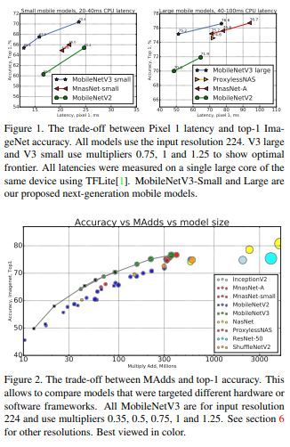

# Searching for MobileNetV3

> **Abstract**
> 
- 기술과 새로운 구조 디자인을 통해, 다음 세대의 MobileNets 구조를 제안한다.
- **MobileNetV3**는 `NetAdapt` 알고리즘을 보완하여, 하드웨어 인식 네트워크 구조 검색(`NAS`)의 조합을 바탕으로 휴대폰 CPU에 맞춰 조정된다. 이 후 새로운 구조 발전을 통해 개선 된다.
- 따라서 2가지의 새로운 MobileNet Model 제시한다 : **MobileNetV3-Large**, **MobileNetV3-Small** 이 두 가지 모델은 높고 낮은 Resource에 사용이 가능하다**.**
- 또한 이러한 모델은 `Object-Detection` 및 `Semantic Segmentation` 작업에 대해 적용될 수 있다.

> **Introduction**
> 

- 효율적인 Nerual Networks는 Mobile Application에 전혀 다른 경험을 가능하게 하는 생각이 보편화 되어 있다.
- 이러한 Nerual Network의 효율성은 높은 정확도와 낮은 지연을 통한 사용자의 경험 향상 뿐만 아니라 전력 소비를 낮춰, 배터리의 수명을 보존할 수 있게 한다.
- 해당 논문은 on-device에서 높은 정확도를 달성할 수 있는 MobileNetV3-Large와 Small에 대한 저자들의 접근을 보여준다.
- 논문의 목적은 Mobile Device에서 정확도와 지연의 Trade-off 최적화 시킬 수 있는 구조를 발전시키는 것이다.

<aside>
📌 **Quantization**은 `Precision Arithmetic` 줄여 Network의 효율성을 늘리는 또 다른 노력이다.

</aside>

> **Efficient Mobile Building Blocks**
> 

- Mobile Modle은 효율적인 Building Blocks 바탕으로 설계되어 왔다.
- MobileNetV1 : 고전적인 Convolution Layer → `Depthwise Separable Convolution` 대체하였다.
- MobileNetV2 : `Linear Bottleneck`과 `Inverted Residual` 구조를 통해 효율적인 Layer 구조를 도입했다.
- MnasNet : MobileNetV2 구조에 입각하여, Bottleneck 구조에 `Squeeze and Excitation`인 `Attention Module` 추가하였다.
- **MobileNetV3** 경우 효과적인 Models 만들기 위해 이러한 Building Block 결합하고, `Swish Nonlinearity` 수정하여 Activation 함수로 사용하였다.

> **Network Search**
> 
- Network Search 방법은 Netowrk 구조를 최적화 하기 위해 가장 강력한 도구이다.
- MobileNetV3에서, 저자들은 NAS(platform-aware) 사용하여 각각의 Network Block 최적화 하였다. 그리고 NetAdapt 알고리즘을 통해 각 Layer의 Filter 수를 찾아 내었다.
- 이러한 방법들은 Hardware Platform에 Modle 최적화 하기에 좋다.

**Platform-Aware NAS for Block-wise Search**

- RNN Controller에 입각하고, 같은 Factorized Hierarchical Search Space 기반으로 비슷한 결과를 갖는 Large Mobile Model 발견하였다.
- Small Model의 경우 정확도 변화에 따라 Latency가 극적으로 변한다. 그렇기 때문에 Small Weight Factor 필요로 했고, `W=-0.15` 설정하였다. 그 다음 `NetAdapt` 그리고 Optimization 통해 Small Mobile Model 획득하였다.

**NetAdapt for Layer-wise Search**

- 다음 구조 탐색인 NetAdapt 기술이다. 이 접근은 NAS(platform-aware) 방식 다음 뒤 따른다 : 각각의 Layer 독립하게 연속적으로 fine-tuning하고 Global Architecture 도출한다.
1. NAS(platform-ware) 발견한 Seed Network에서 출발한다.
2. 각각의 `step` 따른다.
    
    (a) - 새로운 제안을 준비한다. 이전 step과 비교하여 `δ reduction` 통해 구조를 수정한다.
    
    (b) - 각 제안에 대해 pre-trained Model 사용하여 이전 step 보다 Parameter 늘려 새로운 구조를 제안한다.  `Weight` 적절하게 자르고 무작위로 초기화 한다. 그 다음 각 제안을 `T step`에서 미세 조정하여 대략적인 정확도 추정한다.
    
    (c) - 해당 metric에 대해 가장 좋은 제안을 채택한다.
    
3. target의 Latency에 도달할 때 까지 위 `step` 반복한다.
- `Metric`에서 정확도의 변화를 최소화 한다. 따라서 알고리즘을 수정하고 `latency change`와 `accuracy change` 사이의 `ratio` 최소화 한다.
- MobileNetV2에 대하여 저자들은 다음과 같은 방식을 사용하였다.
1. `Expansion Layer`에 대해 Size 줄였다.
2. Residual Connection 유지하는 선에서 모든 Block에 대해 `Bottleneck` 줄였다.

<aside>
📌 `δ  = 0.01 * |L|` 정하였고, L = Seed Model의 Latency 이다.

</aside>

> **Network Improvements**
> 

- Network Search와 추가적으로, 여러 새로운 구성 요소를 추가하여 최종 Model 제안한다.
- Network의 처음부터 끝까지 `Expensive Layer` 새롭게 조정하였다. 또한 최근 Swish 수정하여 `H-Swish(Nonlinearity) Activation` 만들었고, 연산 속도가 훨씬 빠르며 Quantization에도 친숙하다.

**Redesigning Expensive Layers**

- Architecture Search 결과로부터 다른 Layer 보다 `earlier Layer` 및 `last Layer`의 Parameter가 높은지 확인한다. 저자들은 정확도를 유지하면서 이런 Layer의 Latency 줄이려고 수정한다.
- 첫 번째 수정안은 Networks의 `Last Layer`가 Final Features 뽑기 위해 상응하는지 본다. MobileNetV2에서 `1 x 1 Conv` 예측을 위해 Rich Feature 뽑아 낸다. 하지만 비용 측면에서 이는 추가 Latency 발생 시킨다.
- Latency 줄이고, High Dimensional Feature 보존하기 위해 이 Layer 마지막 `Average Pool` 단으로 옮긴다.
- 일단, Feature 추출하는 Layer의 비용이 완화된다면, 이전 Bottleneck Projection Layer는 더 이상 연산을 줄일 필요가 없다.
- 또 다른 접근은 `Expansion Layer`에 대한 `Filter` 수를 정의한다. 이를 토대로 정확도를 유지하면서 Filter 개수를 16개 줄였다.

**Nonlinearities**

- `Swish` 경우 `ReLU` 대신하기 위해 도입되었다. Neural Networks에서 정확도를 향상 시켰다.
    
    $swish(x) = x  * σ(x)$
    
- 이러한 nonlinearity 정확도의 향상을 이루지만, Embedded Environments에서 `Sigmoid`에 기반을 둔 Activation Function은 연산에 많은 비용을 갖는다.
1. Sigmoid Function에 `piece-wise linear` 하여 `H-Swish` 만들었다.
    
    $H-Swish[x] = x * ReLU6(x+3) / 6$
    
    이 수식은 정확도에 영향을 주지 않으며, 개발 관점에서 많은 이점이 있다. 우선 모든 Hardware 및 Software에 대해 최적화되며, Quantized mode 이점, 메모리 접근에 대한 이점도 존재한다.
    
2. nonlinearity 적용하는 비용은 Network가 깊어질 수록 감소한다.

**Large squeeze-and-excite**

- `Squeeze-and-Excite Bottleneck` 구조를 추가하면서, `Expasion Layer`의 `Channel 1/4` 줄였다. 그 결과 정확도가 증가하였으며, Parameter의 차이는 미비했고, Latency 측면 에서도 이점이 있었다.

**MobileNetV3 Definitions**

- 아래의 그림은 MobileNetV3 Network 구조를 설명한다.

> **Conclusions and future work**
> 
- 해당 논문은 **MobileNetV3(Large-Small)** 제안하며, Object Detection 및 Segmentation 및 Classification에서 `State-of-the art` 달성한다.
- 그리고 `swish(Nonlinearity)`와 `Squeeze and Excit`가 Qunatization에 얼마나 효율적으로 동작하는지 설명하고, Mobile Model Domain에서 효과를 증명한다.