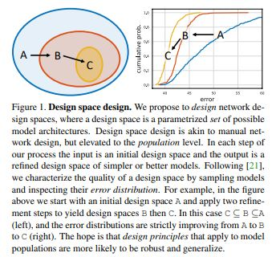

# Designing Network Design Spaces

> **Abstract**
> 
- 논문 저자의 목적은 `Network Designs`에 대한 발전을 돕고 설정을 초월하여 일반화 할 수 있는 `Design Principles` 만들 수 있게 하는 것이다.
- 개별적인 Network의 `Instance` 설계에 집중하는 것 대신에 Network의 `Populations` 변수화 하여 Network Designs 설계한다. 전체적인 진행 방식은 이전의 Networks 설계와 비슷하지만, 공간적 단계에 대해 쌓아 올리는 방식이 다르다.
- Network Design 측면의 구조를 탐색하는 방법을 이용하여 간단하게 Low-Dimensional Design에 도달하였다. 이러한 규칙적인 Network에 대해 **RegNet** 부른다.
- RegNet의 핵심은 Parameter가 간단하다는 것이다. 좋은 Network의 `Depth`와 `Width`는 `Quantized Linear Function` 설명된다.
- RegNet의 설계 공간은 FLOPs에 대해 빠르고 간단하게 작동한다.

<aside>
📌 CPU 환경에 대해서 FLOPs 지표는 의미가 있으나, GPU 환경에선 FLOPs가 모델의 성능을 지칭하진 않는다.

</aside>

> **Introduction**
> 

- 이전의 좋은 구조는 Visual Recognition Task에 대해 상당한 발전을 이루었다. 이러한 연구 결과는  Network Instantiations 뿐만 아니라 Design Principles 이고 거대한 설정에 관해 적용 가능하며 일반화 할 수 있다.
- 효과적인 `Neural Architecture Search (NAS)` 방법에도 불구하고, 패러다임은 제한을 갖는다. NAS의 결과는 구체적인 특정 상황(Hardware Platform)에 대한 Single Network Instance이다.
- 즉, 몇몇 상황에 대해서 충분하게 작동하지만, 새로운 설정에 대한 일반화를 제공하는 Network Design Principles 발견을 가능하게 하진 않는다.
- 따라서 저자는 `Manual Design`과 `NAS`의 이점을 결합한 새로운 Design 패러다임을 제시한다.
- **AnyNet**(VGGNet, ResNet, ResNeXt etc)과 비교하여 Design Space가 더 간단한 Models인 **RegNet**은 쉽게 설명 될 수 있으며, 좋은 Models 갖는 요소들을 갖고 있다.
- RegNet Models 존재하는 다양한 Networks 설정과 비교할 때, 우선 더 Mobile 환경에서 효과적이다. 또한 ResNeXt의 모든 Metric보다 뛰어나다. 마지막으로 EfficientNet Models 보다 5배 더 GPUs 환경에서 빠르다.

> **Design Space Design**
> 
- Visual Recognition 작업을 위해 더 좋은 Network Design 만드는 것이 목적이다. 특정 상황에 맞는 단일 Models 만드는 것이 아닌 범용적인 Models 만드는 것이다. 일반적인 `Design Principles` 찾고 적용해서 전체적인 Model 향상 시킨다.
- 따라서 제한이 없는 초기 상태에서 점진적으로 간단해지는 설계 방법을 제안한다. 그리고 이에 대해 `Design Space Design` 정의한다.
- `Design Space Design`은 Sequential Manual Network Desgin과 유사하지만, Population 단계가 증가한다. 구체적으로 각각의 단계에서 `input`은 `initial design space`이고 `output`은 `refined design space`이다.
- RegNet Design Space **장점**

(1) 허용 가능한 Network 구성 유형과 Dimension 관점에서 간단하다.

(2) 높은 수행 능력을 가진 모델의 능력을 포함한다.

(3) 분석과 해석에 대해서 쉽게 접근이 가능하다.

**Tools for Design Space Design**

- 위 방식에 대한 접근은 `Distributions` 비교하는 것이 (manual or automated) Search 방식을 사용하는 것 보다 더 강인하고 정보가 많다는 점이다. 그리고 2가지 Design Space 비교를 통해 더 좋은 모델을 찾을 수 있다.
- Design Space에 대해 분석하기 위한 지표로 `Empirical Distribution Function(DEF) Error` 사용하였다. F(e) 경우 오류가 e보다 작은 모델 비율을 제공한다.

$F(e) = \frac{1}{n}∑1[e_i < e]$

(1) Design Space 관점에서 취합하고 학습하여 얻어진 `n` models에 대해 Distributions 발생 시킨다.

(2) 연산을 진행하고, EDFs Error에 대해 가시화를 진행하여 Design Space 요약한다.

(3) Design Space에 대해 다양한 관점으로 가시화를 진행하고 `Emprical bootsrap` 사용하여 관점을 얻는다.

(4) 관점을 바탕으로 Design Space 정의한다.

**The AnyNet Design Space**

- 초기 AnyNet Design Space 소개한다. Network Blocks(residual bottleneck blocks etc) 포함하여 Network 구조를 탐색한다. Network 구조는 `Distribution of Compute`, `Parameters`, `Memory` 결정하며, 정확성과 효율성을 결정하는데 핵심으로 작용한다.
- Stem_Block과 Head는 고정하며 Network의 정확성과 효율성을 결정하는 Body 부분에 집중하여 구조를 설계한다.
- Network Body는 `4 Stages` 구성된다. 또한 여기에 Residual Bottleneck Blocks과 Group Convolution 사용한다.

<aside>
📌 AnyNet (X a~ E) Test Visualization

</aside>

**The RegNet Design Space**

- 각각의 Model에 대해, Network 깊이 `d`까지 모든 블록 `J`의 당 폭 `Wj` 그린다.
- 개별 Model에 비슷한 패턴이 적용되는지 확인하기 위해 선을 `piecewise constant function` 방식으로 `Quantize` 하는 전략이 필요했다. **AnyNetXd**와 **AnyNetXe**에 영감을 받아, 블록 폭에 대하여 `linear parameterization` 도입한다.

$u_j = w_0 + w_a j$

- 추가적으로 Wm Parameter 사용하여 Quantization 조절한다. 4 Stage Network만 고려하고 다른 Stage 수에 대해 발생하는 매개 변수는 무시한다.
- **Figure 9** 통해 **RegNetX Model**은 **AnyNetX** 보다 평균 오차가 더 크면서 최상의 모델을 유지한다.

**Design Space Generalization**

- **Figure 10** 결과는 **RegNet**이 새로운 설정에 대해 일반화 할 수 있다는 것을 보여준다. Stage 5에 결과를 토대로 **AnyNetXA** 보다 훨씬 더 많은 Stage 일반화 할 수 있다.

> **Conclusion**
> 
- 논문에서 새로운 Network Design Paradigm 제시한다.
- Design spaces Desgin 방법의 결과는 미래 연구에 대한 방향성을 제시한다.

[Simple, Powerful, and Fast- RegNet Architecture from Facebook AI Research](https://medium.com/visionwizard/simple-powerful-and-fast-regnet-architecture-from-facebook-ai-research-6bbc8818fb44)