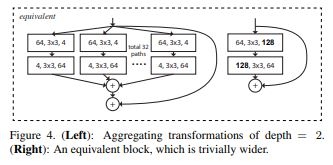

# Aggregated Residual Transformations for Deep Neural Networks

> **Abstract**
> 
- 논문에서 소개하는 Network는 같은 `Topology`에 대해 변형 시킨 Building Block 반복하여 설계하였다. 이 설계는 적은 Hyper-Parameter 통해서 동종의 Multi-Branch한 구조의 결과로 나타났다.
- 앞에서 소개한 전략은 **"Cardinality"** (the size of the set of transformations) 새로운 `Dimension` 생성한다. 이 Dimension은 Depth와 Width Dimension 외에도 필수적인 요소이다.
- 게다가 `Capacity` 위해 Network 깊고, 넓게 만드는 것 보다, Cardinality 증가 시키는 것이 더 효율적이다. 따라서 해당 Model = **ResNeXt**

> **Introduction**
> 

- 많은 Layer단이 존재할 수록 Hyper-Parameter 수가 증가하기 때문에, Network Architecture 설계하기에 어렵다.
- **VGG-nets** : `Stacking Building Blocks` 이러한 규칙은 특정 데이터에 Hyper-Parameter가 과도하게 설정되는 것을 줄여 준다.
- **Inception** : `Spit Transform Merge` 해당 접근은 많은 Layer에 대한 Features 고려할 수 있지만, 연산 복잡성이 높다.
- 해당 논문에서 VGG/ResNets의 `repeating layers` 전략을 채택하는 반면 `split-transform-merge` 전략을 사용하여 쉽게 확장 가능한 구조를 제안한다.
- Network의 Module은Low-Dimensional Embedding에서 변환을 수행하며, 출력은 덧셈으로 나오게 된다. 이 변환은 모든 같은 Topology 통합할 수 있다.
- 저자들은 Transformation 통합 방식이 기존 ResNet Module 보다 성능이 뛰어나며, 연산적 측면이나 모델 크기 면에서도 이점이 있음을 증명했다.
- 해당 방식은 Cardinarity 지칭하며, width 또는 depth 보다 중요하다. **ResNeXt**

> **Method**
> 

 **Template**

- 저자들은 VGG/ResNets의 Module 설계를 채택하면서, Networks는 Residual Block 쌓아서 구성하였다. 이 Block들은 같은 Topology 갖는다. 또한 VGG/ResNets 영감을 받아 간단한 2 개의 규칙들을 따르게 된다.

ⅰ 만약 같은 크기의 `Spatial-map` 생성한다면 같은 Hyper-Parameter(width and filter size) 갖는다.

ⅱ `stride=2` 인해 Spatial-map이 Downsample 된다면 Blocks의 Width 또한 Stride=2 연산을 진행한다.

- 두 번째 규칙은 `FLOPs` 관점에서 모든 Blocks는 같은 연산 복잡도를 갖는다.
- 이러한 규칙들을 통해 Network 좁게 설계할 수 있으며 Key Factors에 집중할 수 있게 만든다.

**Revisiting Simple Neurons**

- Neural Networks의 간단한 뉴런은 `inner product` 수행되며, Fully-Connected와 Convolution의 기본 변환으로 수행된다.
- 해당 연산은 `splitting`, `transforming`, `aggregating` 결합되어 진행된다.

ⅰ**Splitting** : vector x 는 Low-Dimensional Embedding 나눠지며, 그림에서 subspace xi는 단일 Dimension 정의된다.

ⅱ**Transforming** : Low-Dimensional Feature은 간단한 연산을 통해 변형된다. 해당 그림에서 w'*x

ⅲ **Aggregating** : 모든 Embedding 단계에서 변형된 값들을 취합한다. ∑

**Aggregated Transformations**

- 저자는 Elementary Transformation에 대해 Network에서도 사용할 수 있는 일반적인 함수로 변경할 수 있다고 생각하였다. Depth의 Dimension이 증가하는 "Network-in-Network와 대조적으로 **"Network-in-Neuron"**은 새로운 Dimension 확장을 가져온다.

$F(x) = ∑T_i(x)$

- Eqn(2)에 대해 `C`는 통합되기 위한 Transformation 집합의 수가 된다. 즉 `Cardinarity` 이다.
- `Cardinarity`의 Dimension은 Transformation의 수를 관리할 수 있으며, `Width`와 `Depth`의 Dimension 보다 효과적이고 필수적이라는 것을 증명했다.
- Inception 및 Inception-ResNet Module과 달리 Multiple Path에 대해 같은 Topology 공유한다. 저자의 Module은 약간의 노력으로 각 Path들을 생성할 수 있다.

- Block의 `Depth ≥ 3` 때만 Topology에 대해 생산할 수 있다고 알린다. 만약 Block `Depth = 2` 라면 Dense Module 같이 넓게 가져가면 된다.

**Model Capacity**

- ResNeXt는 Model의 연산과 Parameter 수를 유지하면서 정확도를 향상 시켰다. 이러한 과정은 실용적일 뿐만 아니라 중요하다. 왜냐하면 Model은 계층 구조에 따라 Parameter 갖기 때문에 이 진행은 Deep Network의 지표가 되기 때문이다.
- 따라서 Hyper-Parameter 최소화 하려고 노력하였다. 적정한 `Width` 찾고 그에 따른 `Cardinarity` 찾았다. 그렇지 않으면 Input과 Ouput이 고립되는 현상이 발생할 수 있다.