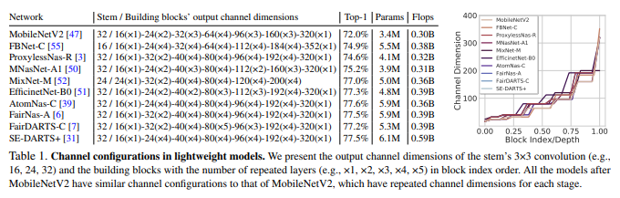

# Rethinking Channel Dimensions for Efficient Model Design

> **Abstract**
> 
- 경량 모델에 대한 정확성이 Network stage의 `piecewise linear function` 보이는 `channel dimensions`에 의해 제한되어 왔다고 주장한다.
- 따라서 이전 설계 보다 수행 측면이 뛰어난 효과적인 channel dimension 배열에 대해 연구하였다. output feature `rank`에 대해 단일 layer 설계하는 방향으로 접근한다.
- 간단하지만 효과적인 channel dimension 배열을 소개하고 이는 **Layer Index** 관점에서 측정 가능하다. 논문에서 제안한 모델은 `channel parameterization` 통해 ImageNet Classification과 Transfer Learning Task에서 뛰어난 성능을 보인다.

> **Introduction**
> 

- 경량 모델들은 각 Network의 channel configuration 따르며 channel 줄여 computational `cost`와 `accuracy` 사이의 trade-off 약속한다.
- 하지만 layer의 `channel expansion` 다르다. 이전 layer에서 작은 channel dimension 줄이고 다음 층에서 객체 수에 맞게 dimension 확장한다. 이는 초기 layer에서 좁은 dimension에 대한 `FLOPs` 효율성을 위함이다.
- 그러나 저자들은 conventional channel configuration 설계된 모델은 FLOPs 효율성에 맞춰 있기 때문에 표현을 제한한다고 설정하였다.
- 따라서 정확도를 고려하며 경량 모델에 대해 효과적인 `channel configuration` 조사하였다.  즉, output feature의 `matrix rank` 기반하여 layer 표현을 추정할 수 있다고 여겼다.
- `expansion layer`에서 적절한 확장 비율을 만들고, 설계 원칙에 의한 연결을 만들기 위해 무작위 크기로 생성된 다수의 Network output feature 평균 rank 연구한다.
- 최적의 channel configuration은 Network Block Index의해 linear function 측정된다.
- 논문에서 검색된 `channel parameterization` 사용하는 새로운 모델을 제안하고 MobileNetv2 간단하게 수정하여 ImageNet Classification에서 성능 향상을 가져온다.

> **Designing an Expansion Layer**
> 
- 모든 Network Architecture 설계할 때 필수적인 비용 관점을 고려하여 적절한 layer 설계하는 방법을 연구한다.

**Preliminary**

**Estimating the expressiveness.**

- 앞 사례는 특정 layer의 표현의 결핍을 다뤄 network 성능을 향상 시킬 수 있는 것을 내포한다.
- 저자는 `rank`가 network의 표현 비용과 밀접하게 연관이 있다고 추측하고, 효율적인 layer 설계하는 지침을 만들기 위해 연구하였다.

**Layer designs in practice**

- inverted bottleneck과 bottleneck 미리 정의된 expansion ratio 통한 `expansion layer` 갖고 있다.

**Empirical study**

**Sketch of the study.**

- `rank`는 기본적으로 input dimension에 묶여 있고, 하위 `nonlinear function`은 rank 증가 시킨다. 그러나 특정 network는 output dimension에 맞게 rank 확장시키는 것에 실패하고 feature 전부 사용하지 못한다.
- 따라서 network 설계할 때, 실패할 방법들을 검증하며 피하고 **ELU**와 **SiLU** `nonlinear function` 효과를 발견했다. 그리고 이것들을 사용하여 경량 모델을 만들었다.

**Materials.**

- building block 사용하여 network 연결한다.
    - single 1 x 1, 3 x 3 convolution layer
    - 3 x 3 convolution, depthwise convolution (inverted bottleneck block)
- $d_{out}$ 무작위로 추출된다. 이는 network size와 맞게 한다. $d_{in}$ 경우 range [0.1 ~ 1.0] 맞게 `channel dimension ratio` 적용한다. 다음 각 모델에 대한 `rank ratio` 계산하고 평균 한다.

**Observations. (Figure 1)**

ⅰDrastic channel expansion harms the rank.

ⅱ Nonlinearities expand rank.

ⅲ Nonlinearities are critical for convolution

**What we learn from the observation.**

1) inverted bottleneck의 `expansion ration`는 `≤ 6` 이다. (1 x 1 convolution 대해)

2) inverted bottleneck의 depthwise convolution 관해 `channel dimension ration = 3` 이다.

3) 복잡한 `nonlinearity` (ELU or SiLU)는 1 x 1, 3 x 3 convolution 후에 대체 되어야 한다.

**Verification of the study.**

- 2개의 inverted bottleneck(IBs) 구성하여 모델을 학습 시킨다. IBs의 `channel Dimension ratio(DR)`과 각 IBs의 첫 번째 `1 x 1 convolution` 조절 한다.

> **Designing with Channel Configuration**
> 

**Problem Formulation**

- 저자의 목적은 연산을 고려하여 network 설계할 때 효과적인 `channel configuration` 찾는 것이다.

- 많은 NAS 방법들은 $c_i$ 고정하고 Network $N$에 대해 channel configuration 찾는다. 하지만 저자는 Network $N$ 고정하고 $c_i$찾는다.

**Searching with channel parameterization**

- channel dimension $c_i = af(i) + b$ 설정하고, `a`와 `b` 탐색했다.
- 다른 변수를 다루기 위해 Network의 stem의 channel dimension 16으로 고정했다. (3 x 3 convolution) 그리고 BN과 ReLU 적용한다. 따라오는 layer 경우 큰 `expansion layer` 갖는다. 또한 `inverted bottleneck` 주요 구성으로 삼는다.

**Search Results**

- 4개의 제약 조건을 할당하고 다른 모델 크기에 대해서 탐색했다. 최종적으로 model’s channel configuration에 대해 **Figure 2** 가시화 했다.
- **Figure 2** 정확도 관점에서 channel configuration 효과적이라는 것을 보여준다.  **Table 3**에 의하면 좋은 모델은 `linear parameterization` 설정하며 linear 하게 channels configure 증가 시키는 것이다.
- network `depth` 고정하고 다른 연산 비용 관점에서 탐색한 결과는 **Figure 4**에 명시하였다.

**Network upgrade**

- channel configuration 사용하여 존재하는 모델을 새롭게 다시 만들었다. inverted bottlenecks의 `output channel dimension`에 parameterization 할당했다.
- Inverted bottleneck의 `expansion ratio = 6` 설정하였고, `expansion layer` 사용한다. 마지막으로 ReLU6 → SiLU 바꾸고 해당 Network 대해 **ReXNet (Rank Expansion Networks)** 부른다.

> **Conclusion**
> 
- 경량 모델에 대해 새로운 접근 방안을 연구한다. NAS 방식으로 생성된 MobileNetv2가 `stage-wise channel` 관점에서 정확도 손실이 발생한다는 추측에서 시작되었다.
- 논문에서 효과적인 channel configuration 찾아내고, block index에 관한 `linear function` 만들었다. (**ReXNet**)