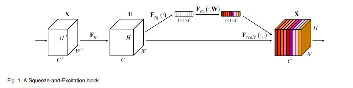
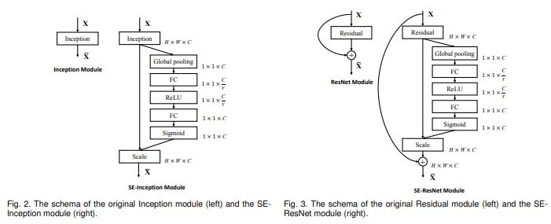
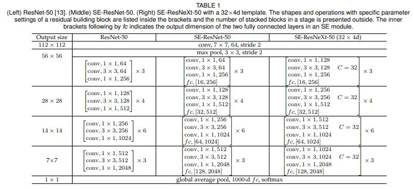
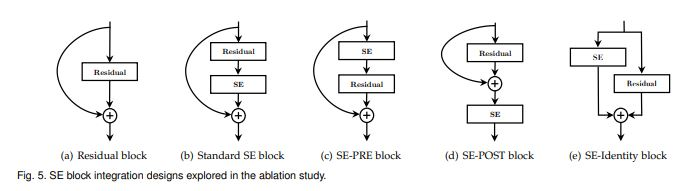

# Squuze-and-Excitation Networks

> **Abstract**
> 
- `Central Building Block of Convolution Neural Networks (CNNs)`은 Convolution 연산자이다. 이 연산은 각 Layer의 `Local Receptive Fields`에서 **공간(Spatial)** 및 **채널(Channel-wise)** 혼합을 통해 Network가 중요한 Features 추출 할 수 있게 만든다.
- 이전의 CNNs 연구는 공간적(Spatial) 요소와 그것들의 관계에 대해 연구하고, Feature 계층의 공간적 Encoding 통해 CNNs Feature 강화하는 방법을 추구했다.
- 해당 논문에선 Channel 관계에 중점을 두어 **Squeeze-and-Excitation (SE Block)**이라는 새로운 Architecture Unit 제안한다.  이 모듈은 Channel 사이의 독립적인 요소를 재구성한다.
- 이 Unit 사용하여 **SENet** Architecture 만든다.

> **Introduction**
> 

- `non-linear activation function`과 `downsampling operator` 사이에 Convolution Layer 끼워 넣으면서, CNNs은 Image의 `Hierarchical Patterns Feature`와 `Global Receptive Fields` 생산 할 수 있다.
- 현재는 공간 의존적인 모델을 추구하고, Network 구조에 Spatial Attention 추가한다. 하지만 논문에서는 Channel간의 관계 측면에서 연구를 진행한다. 따라서 Convolutional Features의 Channel 상호 의존성을 명시적으로 설계하여 Network에서 생성된 Feature-map의 품질을 향상 시키는 것을 목표로 한다.
- **Figure 1**에 대해서 Features `U`는 Squeeze Operation 통과하고, Spatial Dimentions(H x W)에 대해 Feature map 통합한다. 이는 각 Layer의 Global Receptive Field 정보를 Channel-wise 섞어서 생산하는 기능을 한다.
- Excitation Operation에서는 간단하게 Channel Module Weight과 Input 결합하여 형성하는 역할 밖에 하지 않는다.
- `SE Block` 높은 Class-spcific 방식으로 다른 Input에 대해 반응하여 특별해진다. 또한 연산도 약간 증가하기 때문에 크게 상관할 필요는 없다.

> **SQUEEZE-AND-EXCITATION BLOCKS**
> 
- Squeeze-and-Exciatation block은 연산에 관련된 개체이며 Input(X)에 대해 Features(U) 적용하는 Transformation(F) 만들어 낼 수 있다.
- Output이 모든 Channel에 대한 덧셈을 진행하기 때문에, Channel에 대한 Dependencies는 Vc에 통합되며 Filter에 대한 지역 공간적 특성 또한 연결된다.
- 이를 통해 Network는 더 분별 있는 Feature 볼 수 있고 하위 Transformation에 적용할 수 있다.

**Squeeze: Global Information Embedding**

- `Channel Dependencies` 문제를 해결하기 위해, 각 채널에 대한 Output Features 고려하였다. 학습된 각 Filter는 Local Receptive Field와 작동되며, 결과적으로 출력 개체는 외부 지역에 대한 상황 정보를 이용할 수 없게 된다.
- 따라서 Channel Descriptor에 Global 공간적 정보를 압축할 것을 제안하고, Channel-wise Statistics는 `Global Average Pooling` 사용하여 달성할 수 있다.

**Excitation: Adaptive Recalibration**

- Squeeze Operation 통합된 정보를 사용하기 위해, Second Operation 사용하며 이 목적은 Chanel-wise Dependencies 확인하는 것이다. 해당 Function 2가지 기준을 충족해야한다.
1. Channel 사이의 nonlinear 상호작용이 가능하도록 `Flexible` 해야 한다.
2. Multiple Channels 보장하기 위해 non-mutually-exclusive 관계를 보장해야 한다.
- 이를 위하여 `Sigmoid Activation` 사용한다.

$s  = F_ex(z, W) = σ(g(z, W)) = σ(W_2σ(W_1z))$

- Model의 복잡함을 제한하고, 일반화를 돕기 위해, non-linearity 주위에 두 개의 Fully-Connected Layer 구성하여 병목 현상을 형성 함으로써 메커니즘을 만든다. 따라서 ReLU 적용하고 다음 차원 증가 Layer 들어간다. Transformation Output U

**Instantitaions**

- `SE Block`은 VGGNet과 같은 표준 구조에 각각의 Convolution→non-linearity 뒤에 삽입될 수 있다. 게다가 유연하게 표준 Convolution에 직접적으로 삽입 될 수도 있다.

<aside>
📌 - VGGNet
- ResNet
Standard Architecture에 SE Block 삽입하여 `SENet Architecture` 생성한다.
위 Network 뿐만 아니라 MobileNet, ShuffleNet 또한 개념을 비슷하게 가져갈 수 있다.

</aside>

> **MODEL AND COMPUTATIONAL COMPLEXITY**
> 

- SE Block 설계가 실용적으로 사용되기 위해서 `성능 개선`과 `복잡성` 증가 간에 좋은 절충안이 필요하다.
- SE Block 추가할 경우 런타임에 대하여 Overhead가 발생할 수 있다. 따라서 Global Average Pooling 및 GPU Libraries 최적화를 통해 감소할 수 있다고 생각한다.
- 또한 SE Block에 추가 Parameter 삽입 할 수 있는데, 이는 FC Layer에 적용되기 때문에 총 Network 용량에서 작은 부분을 차지한다.

> **Conclusion**
> 

- 논문에서 저자들은 동적 Channel-wise Feature 재구성할 수 있는 `SE Block` 구조를 제안했다.
- 이러한 통찰력이 다른 사람에게 유용하게 사용되길 바란다. `SE Block` 통해 Feature 가치를 파악하여 Model Compression과 같은 작업에도 사용될 수 있다.