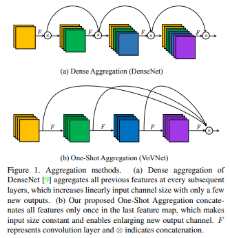
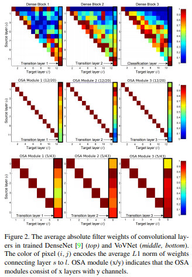
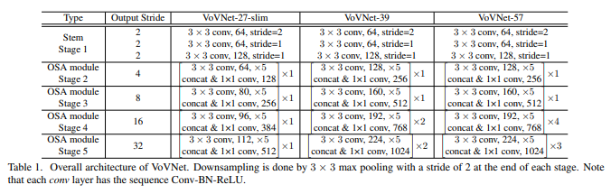
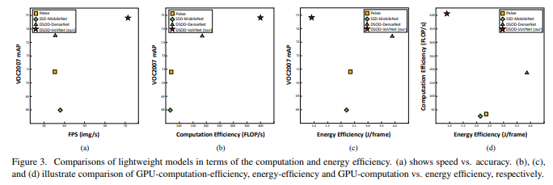

# An Energy and GPU-Computation Efficient Backbone Network fro Real-Time Object Detection

> **Abstract**
> 
- **DenseNet**은 `Dense connection` 기반으로 다양한 Receptive field 취합하여 중간 단계의 Feature-map 보존한다. 이를 통해 Object Detection에서 좋은 성능을 보여준다.
- Feature 재 사용 하는 단점이 있지만 DenseNet Backbone 기반 detector는 낮은 Energy 효율성을 갖는다. 이러한 DenseNet 단점을 극복하기 위해 `One-Shot-Aggregation(OSA)` 구성된 **VoVNet** 제안한다.
- OSA는 DenseNet의 장점인 다층 Receptive field에서 만든 다양한 Feature-map 사용할 뿐만 아니라 `Last Feature-map`만 사용하여 DenseNet의 단점을 극복하기도 한다.
- Backbone Network 관점에서 VoVNet의 효율성을 검증하기 위해, 가볍고 무거운 VoVNet 만들고 one-stage, two-stage detector에 장착하여 실험했다.

> **Introduction**
> 

- 현재 흐름에서 object detector는 가장 좋은 feature extractor 채택하여 사용하는 것이다. DenseNet의 경우 Classification에서 가장 좋은 성능을 보였기 때문에 자연적으로 Detection Task까지 확장하게 되었다.
- ResNet과 DenseNet의 가장 큰 차이는 Feature 결합하는 방식이다. ResNet은 `summation` 접근하고 DenseNet은 `concatentation` 접근한다.
- concatenation이 원본으로부터 가장 정보를 잘 보존한다. 그러므로 feature-map 잘 보존하고 축적하는 DenseNet이 ResNet 보다 Detection 관점에선 우수하다.
- 하지만 DenseNet 경우 ResNet 보다 더 많은 자원과 시간이 필요하다. 이는 `FLOPs`와 `Model_size` 외에도 다른 부분들이 영향을 주기 때문이다.
    1. 중간 단계의 feature-map에 접근하는데 필요한 `memory access cost(MAC)` 중요한 연산 요소이다. 
    2. GPU 병렬 연산 측면에서, DenseNet은 `bottleneck` 처리하는데 제한이 존재하기 때문이다.
- 따라서 목적은 MAC과 GPU-computation efficiency 고려하여 효율적으로 Network 설계하는 것이다. 이를 통해 **One-Shot Aggregation (OSA)** 제안하고, 중간 단계의 feature 한번만 취합한다.

> **Factors of Efficient Network Design**
> 
- 효율적인 Network 설계할 때, `depthwise convolution`과 1 x 1 `convolution bottleneck` 사용하여 FLOPs와 모델 Size에 초점을 두는 경향이 있다. 하지만 이는 항상 GPU에서 Inference  시간을 보장하진 않는다.
- 따라서 FLOPs와 Parameter 넘어 실용적이고 유효한 Metric(energy per image & FPS) 고려하여 설계해야 한다.

**Memory Access Cost**

- DRAM에 접근할 경우, 접근하는 명령이 그 자체를 사용하는 것 보다 더 많은 연산을 필요로 한다. 이는 모델 구조가 같은 computation과 parameter 갖고 있더라도 자원을 소비하는 방식이 다를 수 있다는 것을 의미한다.
- 모델 size와 memory acess 수 사이의 차이는 `intermediate activation memory footprint` 의해 발생한다. 만약 중간 단계의 feature-map 크다면 모델이 같은 parameter 공유하더라도 메모리 접근 비용이 증가한다.

$MAC = hw(C_i + C_o) + k^2_{c_ic_{o}}$

**GPU-Computation Efficiency**

- 모든 Network 구조는 Floating point operation이 모든 device에서 처리 속도가 같다고 생각하고 FLOPs 줄인다. 하지만 GPU에선 다르다. GPU는 병렬 처리 방식을 사용하기 때문이다.
- GPU 병렬 처리는 `Tensor`가 크면 클 수록 그 효과가 나온다. 따라서 convolution 여러 작은 단계로 분할하여 처리하는 것은 비 효율성을 가져온다.

> **Proposed Method**
> 

**Rethinking Dense Connection**

- DenseNet의 수행은 실용적으로 보이나 `energy`와 `time` 관점에서 몇몇 결점들이 보인다.
- `Dense connection`은 input channel size 증가하는 반면 output channel size 고정이다. 결과적으로 각 Layer는 channel size에 대한 불균형이 나타난다.
- 그러므로 같은 parameter 갖고 있다고 하더라도 높은 MAC 초래하여 더 많은 자원과 시간이 소요된다.
- model size가 큰 경우 input size 증가는 중요한 문제이다. 왜냐하면 depth가 증가할 수록 점진적으로 더 많은 연산을 요구하기 때문이다.
- 이러한 비효율성 때문에 학습 기간에 `Dense Connection`이 features 취합하는 방법을 조사했다. 그리고 `intermediate layer`와 `final layer` 간의 부정적인 연결이 있다고 가정하였다.
- `Dense Connection` 은 `intermediate layer`가 더 좋은 feature 만들 수 있게 만든다. 뿐만 아니라 `former layer` 에서 파생된 feature 비슷하게 만든다. 이 경우 final layer는 양쪽의 feature 취합할 필요가 없다. 이미 풍부한 특징 정보를 갖고 있기 때문이다. (redundant information)

**One-Shot Aggregation**

- 이전 방향을 기반으로 효율적인 구조를 조사하였고, `one-shot aggregation(OSA) module` 만들었고 이 module은 마지막에 한번만 feature 결합(concat) 한다.
- 게다가 `OSA module`의 `transition layer` weight는 DenseNet과 다른 양상을 보인다. shallow depth 파생된 feature는 `trainsition layer`에서 더 잘 결합된다.
- 비록 OSA module이 **CIFAR-10**에서 약간 성능이 떨어지지만 Dense Block 보다 덜 MAC 소요된다. 또한 GPU computation efficiency 강하다.

**Configuration of VoVNet**

- `OSA module`에서 다양한 feature와 발생한 효율성으로 인하여 **VoVNet** 적은 module 사용해 accuracy와 speed가 좋아졌다.
- VoVNet은 3개의 convolution layer 구성된 stem block과 OSA module 사용하는 4개의 stage 구성되어 있다. (output stride = 32)

> **Conclusion**
> 

- real-time object detection 중점인 논문에서 **VoVNet** 효율적인 backbone networks 제안한다. multi receptive field 다양한 features 사용하고 DenseNet의 비효율성을 개선한다.